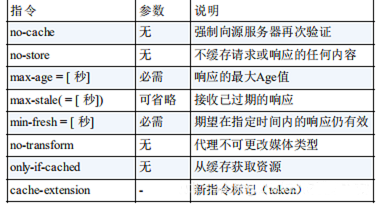

参考：

https://www.toutiao.com/i7054878780560638503/?tt_from=weixin&utm_campaign=client_share&wxshare_count=1&timestamp=1645086590&app=news_article&utm_source=weixin&utm_medium=toutiao_android&use_new_style=1&req_id=20220217162950010151152166250FDD07&share_token=9128ad79-d31d-471a-95ef-108cdb02cf0e&group_id=7054878780560638503

## 1. 什么是Http协议？

超文本传输协议（英文：HyperText Transfer Protocol，缩写：HTTP）是一种用于分布式、协作式和超媒体信息系统的应用层协议。HTTP是万维网的数据通信的基础。

应用 HTTP 协议时，必定是一端担任客户端角色，另一端担任服务器端角色。

有时候，按实际情况，两台计算机作为客户端和服务器端的角色有可 能会互换。但就仅从一条通信路线来说，服务器端和客户端的角色是确定的，而用 HTTP 协议能够明确区分哪端是客户端，哪端是服务器端。

HTTP 协议规定，请求从客户端发出，最后服务器端响应该请求并返 回。换句话说，肯定是先从客户端开始建立通信的，服务器端在没有 接收到请求之前不会发送响应。
    
## 2. HTTP的报文结构
    
对于 TCP 而言，在传输的时候分为两个部分:TCP头和数据部分。

而 HTTP 类似，也是header + body的结构，具体而言:起始行 + 头部 + 空行 + 实体。

### 2.1 起始行

请求报文的请示行和响应报文的起始行还是有些区别的。

对于请求报文来说，起始行如下：
```
GET /home HTTP/1.1
方法类型(区分大小写) + 路径 + http路径
```

对于响应报文来说，起始行(状态行)如下：
```
HTTP/1.1 200 OK
http版本 + 状态码 + 原因
```

要说明一点的是，在起始行中，每两个部分之间用空格隔开，最后一个部分后面应该接一个换行，严格遵循ABNF语法规范。

### 2.2 头部

头部字段一般分为以下几种：请求头部，响应头部，通用头部，实体头部

请求头和响应头在报文中的位置如下：


头部字段的格式一般如下：

1.字段名不区分大小写

2.字段名不允许出现空格，不可以出现下划线_

3.字段名后面必须紧接着:

### 2.3 空行

空行用来区分开头部和实体。

### 2.4 实体

指具体的数据了，也就是body部分。请求报文对应请求体, 响应报文对应响应体。
    
## 3. HTTP的请求方式
    
http/1.1规定了以下请求方法：
- GET: 通常用来获取资源
- HEAD: 获取资源的元信息
- POST: 提交数据，即上传数据
- PUT: 修改数据
- DELETE: 删除资源(几乎用不到)
- CONNECT: 建立连接隧道，用于代理服务器
- OPTIONS: 列出可对资源实行的请求方法，用来跨域请求
- TRACE: 追踪请求-响应的传输路径

以上八种请求方式，GET和POST是我们用的最多的两种请求方式也是最重要的两种。 
    
## 4. GET和POST的区别  

- 从缓存的角度，GET 请求会被浏览器主动缓存下来，留下历史记录，而 POST 默认不会。

- 从编码的角度，GET 只能进行 URL 编码，只能接收 ASCII 字符，而 POST 没有限制。

- 从参数的角度，GET 一般放在 URL 中，因此不安全，POST 放在请求体中，更适合传输敏感信息。

- 从幂等性的角度，GET是幂等的，而POST不是。(幂等表示执行相同的操作，结果也是相同的)

- 从TCP的角度，GET 请求会把请求报文一次性发出去，而 POST 会分为两个 TCP 数据包，首先发 header 部分，如果服务器响应 100(continue)， 然后发 body 部分。(火狐浏览器除外，它的 POST 请求只发一个 TCP 包)
    
## 5. Http的状态码
    
状态码的职责是当客户端向服务器端发送请求时，描述返回的请求结果。借助状态码，用户可以知道服务器端是正常处理了请求，还是出现了错误。

一般分为以下几种类别：
- 1XX：为信息性状态码，表示接收的请求正在处理。
- 2XX：为成功状态码，表示请求正常处理完毕。
- 3XX：为重定向状态码，表示需要进行附加操作以完成请求。
- 4XX：为客户端错误状态码，表示服务器无法处理请求。
- 5XX：为服务端错误状态码，服务器处理请求出错。

常见的状态码例如：
- 200 OK 请求成功被处理，且返回了数据。
- 204 No Content 请求成功被处理，但是没有数据资源要返回。
- 301 Moved Permanently 永久性重定向。该状态码表示请求的资源已被分配了新的 URI，以后 应使用资源现在所指的 URI。
- 302 Found 临时性重定向。该状态码表示请求的资源已被分配了新的 URI，希望 用户（本次）能使用新的 URI 访问。
- 304 Not Modified 在下面说到http对比缓存的时候会聊到，表示资源没有被修改，可以使用缓存。
- 400 Bad Request 表示请求报文中存在语法错误。当错误发生时，需修改请求 的内容后再次发送请求。
- 401 Unauthorized 未认证需要认证后在重新请求。
- 403 Forbidden 表明对请求资源的访问被服务器拒绝了。
- 404 Not Found 表明服务器上无法找到请求的资源。
- 500 Internal Server Error 表明服务器端在执行请求时发生了错误。
- 503 Service Unavailable 表明服务器暂时处于超负载或正在进行停机维护，现在无法 处理请求。
    
## 6. Http协议中重要的头部字段
    
上面我们说了Http头部字段(首部字段)一般分为四种：

1.通用首部字段：


2.请求首部字段:


3.响应首部字段:


4.实体首部字段


下面我们挑几个经常性问道的首部字段进行说明。
    
### 6.1 Cache-Control

通过指定首部字段 Cache-Control 的指令，能够操作缓存的工作机制。

指令的参数是可选的，多个指令之间通过“,”分隔。首部字段 Cache- Control 的指令可用于请求及响应时。
```
Cache-Control: private, max-age=0, no-cache
```

在请求中，Cache-Control有以下可选指令：



在响应中，Cache-Control有以下可选指令：


​1.no-cache 指令:

使用 no-cache 指令的目的是为了防止从缓存中返回过期的资源。客户端发送的请求中如果包含 no-cache 指令，则表示客户端将不会接收缓存过的响应。

如果服务器返回的响应中包含 no-cache 指令，那么缓存服务器不能对 资源进行缓存。源服务器以后也将不再对缓存服务器请求中提出的资 源有效性进行确认，且禁止其对响应资源进行缓存操作。

2.no-store 指令:

从字面意思上很容易把 no-cache 误解成为不缓存，但事实上 no-cache 代表不缓存过期的资源，缓存会向源服务器进行有效期确认后处理资源。no-store 才是真正地不进行缓存。

3.max-age 指令:
```
Cache-Control: max-age=604800（单位：秒）
```
当客户端发送的请求中包含 max-age 指令时，如果判定缓存资源的缓存时间数值比指定时间的数值更小，那么客户端就接收缓存的资源。

当服务器返回的响应中包含 max-age 指令时，缓存服务器将不对资源的有效性再作确认，而 max-age 数值代表资源保存为缓存的最长时间

### 6.2 Connection

Connection 首部字段具备如下两个作用。

1.控制不再转发给代理的首部字段。
```
Connection: 不再转发的首部字段名
```
在客户端发送请求和服务器返回响应内，使用 Connection 首部字 段，可控制不再转发给代理的首部字段。

2.管理持久连接。
```
Connection: close/Keep-Alive
```
HTTP 协议的初始版本中，每进行一次 HTTP 通信就要断开一次 TCP 连接。如果一次性有多个Http请求，很明显每次TCP/IP握手和挥手都会带来一定的开销。

HTTP/1.1 版本的默认连接都是持久连接。为此，客户端会在持 久连接上连续发送请求。当服务器端想明确断开连接时，则指定 Connection 首部字段的值为 Close。

HTTP/1.1 之前的 HTTP 版本的默认连接都是非持久连接。为 此，如果想在旧版本的 HTTP 协议上维持持续连接，则需要指定 Connection 首部字段的值为 Keep-Alive。
    
### 6.3 Transfer-Encoding
    
Transfer-Encoding 规定了传输报文主体时采用的编码方式。

例如：
```
Transfer-Encoding: chunked
```

当返回的数据比较大时，如果等待生成完数据再传输，这样效率比较低下。相比而言，服务器更希望边生成数据边传输。可以在响应头加上chunked字段标识分块传输。

设置这个字段后会自动产生两个效果:

Content-Length 字段会被忽略。

基于长连接持续推送动态内容。

如何标识传输完毕呢？

当传输完若干个数据块后，需要再传输一个空的数据块。当客户端收到空的数据块时，则客户端知道数据接收完毕。
    
### 6.4 Accept
    
Accept 首部字段可通知服务器，客户端能够处理的媒体类型及媒体类型的相对优先级。可使用 type/subtype 这种形式，一次指定多种媒体类型。

```
Accept: text/html,application/xhtml+xml,application/xml;q=0.
```
### 6.5 Accept-Encoding

Accept-Encoding 首部字段用来告知服务器客户端支持的内容编码及内容编码的优先级顺序。可一次性指定多种内容编码。
```
Accept-Encoding: gzip, deflate
```
下面举出几个内容编码的例子。

gzip：

由文件压缩程序 gzip（GNU zip）生成的编码格式 （RFC1952），采用 Lempel-Ziv 算法（LZ77）及 32 位循环冗余 校验（Cyclic Redundancy Check，通称 CRC）。

compress：

由 UNIX 文件压缩程序 compress 生成的编码格式，采用 Lempel- Ziv-Welch 算法（LZW）。

deflate:

组合使用 zlib 格式（RFC1950）及由 deflate 压缩算法 （RFC1951）生成的编码格式。

identity:

不执行压缩或不会变化的默认编码格式
    
### 6.6 Accept-Language
    
首部字段 Accept-Language 用来告知服务器客户端支持的语言指中文或英文等），以及支持的相对优先级。可一次指定多种语言。
    
### 6.7 If-Modified-Since
    
If-Modified-Since 用于确认代理或客户端拥有的本地资源的有效性。获取资源的更新日期时间，可通过确认首部字段 Last-Modified 来确定。

在指定 If-Modified-Since 字段值的日期时间之后，如果请求的资源都没有过更新，则返回状态码 304 Not Modified 的响应。否则服务器会响应该请求。

### 6.8 Range
```
Range: bytes=5001-10000
```
对于只需获取部分资源的范围请求，包含首部字段 Range 即可告知服务器资源的指定范围。上面的示例表示请求获取从第 5001 字节至第 10000 字节的资源。

接收到附带 Range 首部字段请求的服务器，会在处理请求之后返回状态码为 206 Partial Content 的响应。无法处理该范围请求时，则会返 回状态码 200 OK 的响应及全部资源。
    
### 6.9 User-Agent
```
User-Agent: Mozilla/5.0 (Windows NT 6.1; WOW64; rv:13.0) Gecko/201
```
User-Agent 会将创建请求的浏览器和用户代理名称等信息传 达给服务器。

### 6.10 ETag
```
ETag: "82e22293907ce725faf67773957acd12"
```
ETag 能告知客户端实体标识。它是一种可将资源以字符串 形式做唯一性标识的方式。服务器会为每份资源分配对应的 ETag 值。

当资源更新时，ETag 值也需要更新。 ETag 值由服务器来分配。
    
### 6.11 Allow
```
Allow: GET, HEAD
```
Allow 用于通知客户端能够支持的指定资源的所有 HTTP 方法。当服务器接收到不支持的 HTTP 方法时，会以状态码 405 Method Not Allowed 作为响应返回。与此同时，还会把所有能支持的 HTTP 方法写入首部字段 Allow 后返回。

### 6.12 Content-Encoding
```
Content-Encoding: gzip
```
Content-Encoding 会告知客户端服务器对实体的主体部分选用的内容编码方式。内容编码是指在不丢失实体信息的前提下所进行的压缩。

### 6.13 Content-Length
```
Content-Length: 15000
```
Content-Length 表明了实体主体部分的大小（单位是字 节）。

### 6.14 Content-Range
```
Content-Range: bytes 5001-10000/10000
```
针对范围请求，返回响应时使用 Content-Range，告知客户端作为响应返回的实体的哪个部分符合范围请求。字段值以字节为单位，表示当前发送部分及整个实体大小。

### 6.15 Content-Type
```
Content-Type: text/html; charset=UTF-8
```
Content-Type 说明了实体主体内对象的媒体类型。和 Accept 一样，字段值用 type/subtype 形式赋值。

### 6.16 Expires
```
Expires: Wed, 04 Jul 2012 08:26:05 GMT
```
Expires 会将资源失效的日期告知客户端。

如果当Cache-Control 有指定 max-age 指令时，比起Expires，会优先处理 max-age 指令。
    
### 6.17 Last-Modified
```
Last-Modified: Wed, 23 May 2012 09:59:55 GMT
```
首部字段 Last-Modified 指明资源最终修改的时间。
    
## 7. 聊聊Cookie

HTTP 是一个无状态的协议，每次 http 请求都是独立、无关的，默认不需要保留状态信息。但有时候需要保存一些状态，怎么办呢？

Http引入了Cooike技术来解决上面所说的问题。Cookie 技术通过在请求和响应报文中写入 Cookie 信息来控制客户端的状态。

Cookie 本质上就是浏览器里面存储的一个很小的文本文件，内部以键值对的方式来存储。

Cookie 会根据从服务器端发送的响应报文内的一个叫做 Set-Cookie 的 首部字段信息，通知客户端保存 Cookie。

当下次客户端再往该服务器 发送请求时，客户端会自动在请求报文中加入 Cookie 值后发送出去。服务器端发现客户端发送过来的 Cookie 后，会去检查究竟是从哪一 个客户端发来的连接请求，然后对比服务器上的记录，最后得到之前的状态信息。

Cookie交互的流程大致如下图：


Cookie生存周期

Cookie 的有效期可以通过Expires和Max-Age两个属性来设置。

Expires表示过期时间

Max-Age用的是一段时间间隔，单位是秒，从浏览器收到报文开始计算。

若 Cookie 过期，则这个 Cookie 会被删除，并不会发送给服务端。

Cookie作用域

关于作用域也有两个属性: Domain和path, 给 Cookie 绑定了域名和路径，在发送请求之前，发现域名或者路径和这两个属性不匹配，那么就不会带上 Cookie。值得注意的是，对于路径来说，/表示域名下的任意路径都允许使用 Cookie。

HttpOnly 属性

Cookie 的 HttpOnly 属性是 Cookie 的扩展功能，只能通过 HTTP 协议传输，它使 JS 脚本无法获得 Cookie。其主要目的为防止跨站脚本攻击（Cross-site scripting，XSS）对 Cookie 的信息窃取。

相应的，对于 CSRF 攻击的预防，也有SameSite属性。

Cookie 的缺点

容量缺陷：Cookie 的体积上限只有4KB，只能用来存储少量的信息。

性能缺陷：Cookie 紧跟域名，不管域名下面的某一个地址需不需要这个 Cookie ，请求都会携带上完整的 Cookie，这样随着请求数的增多，其实会造成巨大的性能浪费的，因为请求携带了很多不必要的内容。但可以通过Domain和Path指定作用域来解决。

安全缺陷：由于 Cookie 以纯文本的形式在浏览器和服务器中传递，很容易被非法用户截获，然后进行一系列的篡改，在 Cookie 的有效期内重新发送给服务器，这是相当危险的。另外，在HttpOnly为 false 的情况下，Cookie 信息能直接通过 JS 脚本来读取。

## 8. 聊聊Http代理
    
HTTP 是基于请求-响应模型的协议，一般由客户端发请求，服务器来进行响应。但有时候客户端的请求并不会直接就到源服务器。为了解决一些问题，在请求过程中，可能会有代理服务器进行中转。

代理服务器的功能是什么呢？

1.负载均衡。客户端的请求会先到达代理服务器，代理服务器可以拿到这个请求之后，可以通过特定的算法分发给不同的源服务器，让各台源服务器的负载尽量平均。

2.保障安全。利用心跳机制监控后台的服务器，一旦发现故障机就将其踢出集群。并且对于上下行的数据进行过滤，对非法 IP 限流。

3.缓存代理。将内容缓存到代理服务器，使得客户端可以直接从代理服务器获得而不用到源服务器那里。
    
## 9. 聊聊Http缓存
 
HTTP 的缓存机制是依赖于请求和响应头部里的头部字段的值实现的，重要的字段我们上面都有介绍到，最终响应式从缓存中取，还是从服务端重新拉取。整体流程我们还是借用一张图简单概括一下：


HTTP 的缓存可以分为两种：

强制缓存：不需要服务端再次参与判断是否继续使用缓存，当客户端第一次请求数据时，服务端返回了缓存的过期时间（Expires 与 Cache-Control），没有过期就可以继续使用缓存，否则就不使用，无需再向服务端询问。

对比缓存：需要服务端参与再次判断是否继续使用缓存，当客户端第一次请求数据时，服务端会将缓存标识（
Last-Modified/If-Modified-Since 与 Etag/If-None-Match）与数据一起返回给客户端，客户端将两者都备份到缓存中 ，再次请求数据时，客户端将上次备份的缓存标识发送给服务端，服务端根据缓存标识进行判断， 如果返回 304，则表示通知客户端可以继续使用缓存。否则会连带着最新的数据一起返回给客户端。

强制缓存优先于对比缓存。 上面提到强制缓存使用的的两个标识：

Expires：Expires 的值为服务端返回的到期时间，即下一次请求时，请求时间小于服务端返 回的到期时间，直接使用缓存数据。到期时间是服务端生成的，客户端和服务端的时间可能有误差。

Cache-Control：Expires 有个时间校验的问题，所有 HTTP1.1 采用 Cache-Control 替代 Expires。

上面我们也也说到Cache-Control 的取值有以下几种：

private: 客户端可以缓存。 public: 客户端和代理服务器都可缓存。

max-age=xxx: 缓存的 内容将在 xxx 秒后失效

no-cache: 需要使用对比缓存来验证缓存数据。

no-store: 所有内容都不会缓存，强制缓存，对比缓存都不会触发。 我们再来看看对比缓存的两个标识：

Last-Modified/If-Modified-Since Last-Modified 表示资源上次修改的时间。 当客户端发送第一次请求时，服务端返回资源上次修改的时间：

Last-Modified: Tue, 12 Jan 2016 09:31:27 GMT 客户端再次发送，会在 header 里携带 If-Modified-Since。将上次服务端返回的资源时间上 传给服务端。

If-Modified-Since: Tue, 12 Jan 2016 09:31:27 GMT 服务端接收到客户端发来的资源修改时间，与自己当前的资源修改时间进行对比，如果自己 的资源修改时间大于客户端发来的资源修改时间，则说明资源做过修改， 则返回 200 表示 需要重新请求资源，否则返回 304 表示资源没有被修改，可以继续使用缓存。 上面是一种时间戳标记资源是否修改的方法，还有一种资源标识码 ETag 的方式来标记是否 修改，如果标识码发生改变，则说明资源已经被修改，ETag 优先级高于 Last-Modified。 Etag/If-None-Match ETag 是资源文件的一种标识码，当客户端发送第一次请求时，服务端会返回当前资源的标 识码： ETag: “5694c7ef-24dc” 客户端再次发送，会在 header 里携带上次服务端返回的资源标识码： If-None-Match:“5694c7ef-24dc” 服务端接收到客户端发来的资源标识码，则会与自己当前 的资源吗进行比较，如果不同，则说明资源已经被修改，则返回 200，如果相同则说明资源 没有被修改，返回 304，客户端可以继续使用缓存。

## 10. 聊聊Http的缺点

HTTP的主要缺点其实还是不够安全，主要有以下三点：

1.通信使用明文（不加密），内容可能会被窃听。

2.不验证通信方的身份，因此有可能遭遇伪装。

3.无法证明报文的完整性，所以有可能已遭篡改。