参考：   
    https://www.toutiao.com/i7064847051992891937/?tt_from=weixin&utm_campaign=client_share&wxshare_count=1&timestamp=1645079346&app=news_article&utm_source=weixin&utm_medium=toutiao_android&use_new_style=1&req_id=202202171429050101501610251408D54D&share_token=0ceda89b-e585-4e7c-a6f2-5265c4115ef1&group_id=7064847051992891937&wid=1645079464953

1. 计算机网络分层体系结构

    - 应用层：为应用程序提供交互服务。在互联网中的应用层协议很多，如域名系统DNS、HTTP协议、SMTP协议等。

    - 传输层：负责向两台主机进程之间的通信提供数据传输服务。传输层的协议主要有传输控制协议TCP和用户数据协议UDP。
    
    - 网络层：选择合适的路由和交换结点，确保数据及时传送。主要包括IP协议。
    
    - 数据链路层：在两个相邻节点之间传送数据时，数据链路层将网络层交下来的 IP 数据报组装成帧，在两个相邻节点间的链路上传送帧。
    
    - 物理层：实现相邻节点间比特流的透明传输，尽可能屏蔽传输介质和物理设备的差异。
    
2. 三次握手

    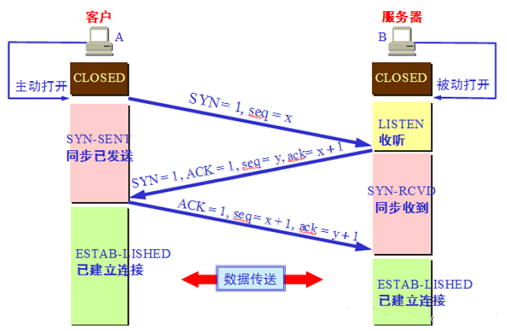
    
3. 四次挥手

    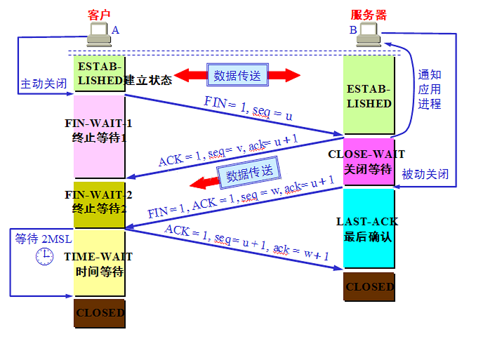
    
4. 为什么不是两次握手

    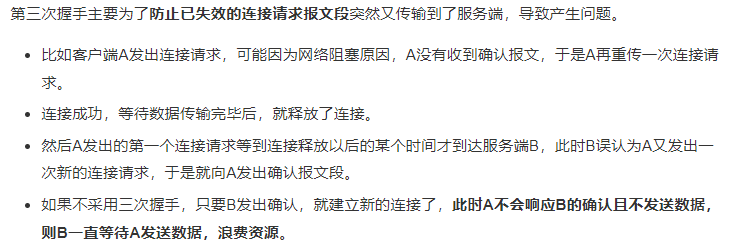
    
5. 四次挥手中为什么等待2MSL

    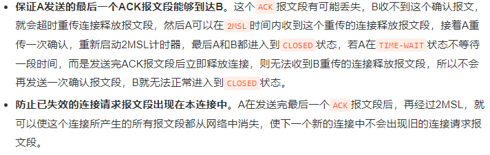
    
6. HTTP和HTTPS的区别

    - http 协议是免费使用的，而 https 协议需要到CA机构申请证书，需要缴纳费用
    
    - http 是超文本传输协议，信息是明文传输，https 则是具有安全性的 SSL/TLS 加密传输协议，信息是密文
    
    - http 的连接很简单，是无状态的；https 协议是由SSL/TLS+HTTP协议构建的可进行加密传输、身份认证的网络协议，比 http 协议安全
    
    - 和 http 通信相比，https 通信会由于加减密处理消耗更多的CPU和内存资源
    
    - http 和 https 使用的端口也不一样，前者是80，后者是443
    
7. 对称加密和非对称加密

    对称加密：
    对称加密是指加密和解密使用同一个密钥的方式，一方通过密钥将信息加密后，把密文传给另一方，
    另一方通过这个相同的密钥将密文解密，转换成可以理解的明文。
    
    非对称加密： 
    使用一对非对称密钥加密，即公钥和私钥，公钥可以随意发布，任何人都能获得，但私钥只有自己知道。
    
    发送密文的一方使用对方的公钥进行加密处理，对方接收到加密信息后，使用自己的私钥进行解密。
    公开密钥与私有密钥是一对，如果用公开密钥对数据进行加密，只有用对应的私有密钥才能解密；
    如果用私有密钥对数据进行加密，那么只有用对应的公开密钥才能解密。因为加密和解密使用的是两个不同的密钥，所以叫作非对称加密。

8. 什么是数字证书

    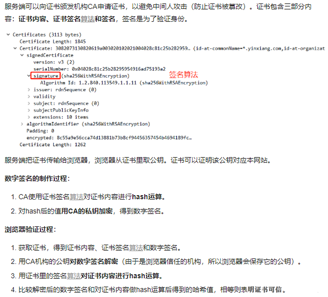
    
9. HTTPS工作流程

    HTTPS 协议是安全的，因为 HTTPS 协议会对传输的数据进行加密，而加密过程是使用了非对称加密实现。
    但是 HTTPS 在内容传输使用的是对称加密，在证书验证阶段使用非对称加密。

    所以HTTPS加密方式是：对称加密 + 非对称加密混合。
    
    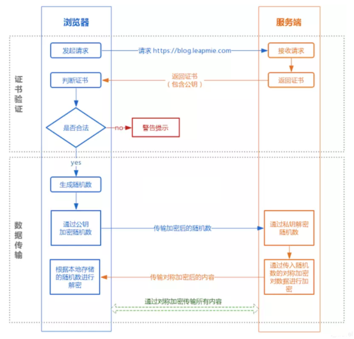
    
    ① 证书验证阶段：

    1）浏览器发起 HTTPS 请求；
    
    2）服务端返回 HTTPS 证书；
    
    3）客户端验证证书是否合法，如果不合法则提示告警。
    
    ② 数据传输阶段：
    
    1）当证书验证合法后，在本地生成随机数；
    
    2）通过公钥加密随机数，并把加密后的随机数传输到服务端；
    
    3）服务端通过私钥对随机数进行解密；
    
    4）服务端通过客户端传入的随机数构造对称加密算法，对返回结果内容进行加密后传输。
    
10. HTTP常见状态码
    
    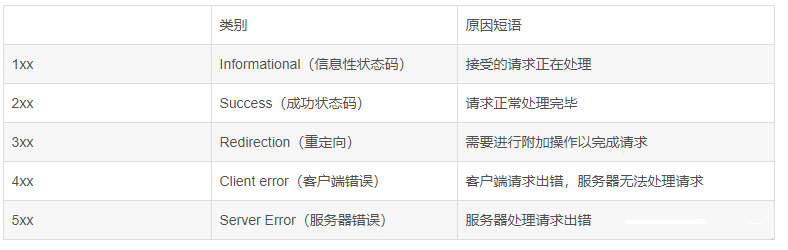 
    
    - 200 OK：表示从客户端发送给服务器的请求被正常处理并返回成功
    
    - 301 Moved Permanently：永久性重定向，表示请求的资源被分配了新的URL，之后应使用更改的URL；
    
    - 302 Found：临时性重定向，表示请求的资源被分配了新的URL，希望本次访问使用新的URL；
    
    - 400 Bad Request：表示请求报文存在语法错误；
    
    - 403 Forbidden：服务器拒绝该次访问（访问权限问题）；
    
    - 404 Not Found：表示服务器上无法找到请求的资源（也可以在服务器拒绝请求但不想给拒绝原因时使用）；
    
    - 500 Inter Server Error：表示服务器在执行请求时发生了错误，也有可能是web应用存在的bug或某些临时的错误时；
    
    - 503 Server Unavailable：表示服务器暂时处于超负载或正在进行停机维护，无法处理请求；
    
11. HTTP长连接和短连接，流水线是什么
    
    长连接和短连接：
    - HTTP1.0默认使用的是短连接。浏览器和服务器每进行一次HTTP操作，就建立一次连接，任务结束就中断连接。
    
    - HTTP/1.1起默认使用长连接。要使用长连接，客户端和服务器的HTTP响应头部的Connection要设置为keep-alive，才能支持长连接。
    
    - HTTP长连接，指的是复用TCP连接。多个HTTP请求可以复用同一个TCP连接，这就节省了TCP连接建立和断开的消耗。
    
    流水线：
    - 默认情况下，HTTP 请求是按顺序发的，下一个请求只有在当前请求收到响应之后才会被发出，有点像停止等待协议。
    
    - 而在收到下一个请求之前，可能需要很长时间。流水线就是在一个 HTTP 长连接下连续发出请求，不用等待响应返回，减少延迟。
    
12. GET和POST的区别和应用

    - GET产生的URL地址可以在书签收藏，而POST不可以。

    - GET请求会被浏览器主动缓存，而POST不会，除非手动设置。
    
    - GET请求只能进行url编码，而POST支持多种编码方式。
    
    - GET请求参数会被完整保留在浏览器历史记录里，而POST中的参数不会被保留。
    
    - GET请求在URL中传送的参数是有长度限制的（通常URL不大于2048个字符），而POST没有。
    
    - 对参数的数据类型，GET只接受ASCII字符，而POST没有限制。
    
    - GET比POST更不安全，因为参数直接暴露在URL上，所以不能用来传递敏感信息。
    
    - GET参数通过URL拼接传递，POST参数通过请求体传递
    
    - GET产生一个TCP数据包；POST产生两个TCP数据包。对于GET方式的请求，浏览器会把请求头和请求体一并发送出去；
      而对于POST，浏览器先发送请求头，服务器响应100 continue，浏览器再发送请求体。

13. TCP和UDP的区别和应用

    - TCP是可靠传输，UDP是不可靠传输;

    - TCP面向连接，UDP无连接，即发送数据之前不需要建立连接
    
    - TCP传输数据有序，UDP不保证数据的有序性;
    
    - TCP面向字节流，把数据看成一连串字节流，UDP是面向报文的
    
    - TCP传输速度相对UDP较慢;
    
    - TCP有流量控制和拥塞控制，UDP没有;
    
    - TCP是重量级协议，UDP是轻量级协议;
    
    - TCP首部20字节，UDP首部8字节;
    
    - TCP连接只能是一对一的（端到端）；UDP支持一对一、一对多、多对一和多对多的通信方式。
    
14. 浏览器从输入URL到返回页面经历了什么
    
    - 输入网址 输入要访问的网址，即URL

    - 缓存解析 浏览器获取URL后，先去缓存中查找资源，从浏览器缓存-系统缓存-路由器缓存中查看； 如果有就从缓存中显示界面，不再发送请求； 如果没有，则发送http请求；
    
    - 域名解析 发现缓存中没有资源，发送http请求； 在发送http请求之前，需要进行DNS解析(域名解析)； DNS解析：域名到IP地址的转换过程，域名的解析工作由DNS服务器完成，解析后可以获取域名相应的IP地址；
    
    - TCP连接 三次握手在域名解析后，浏览器向服务器发起了http请求，TCP连接； 因为TCP协议时面向连接的，所以在传输数据前必须建立连接，即三次握手；TCP连接建立后，浏览器开始向服务器发送http请求报文
    
    - 收到请求 服务器收到浏览器发送的请求信息，返回响应
    
    - 页面渲染 浏览器收到服务器发送的响应，显示页面内容。
    
15. 什么是Cookies和Session，二者区别
    
    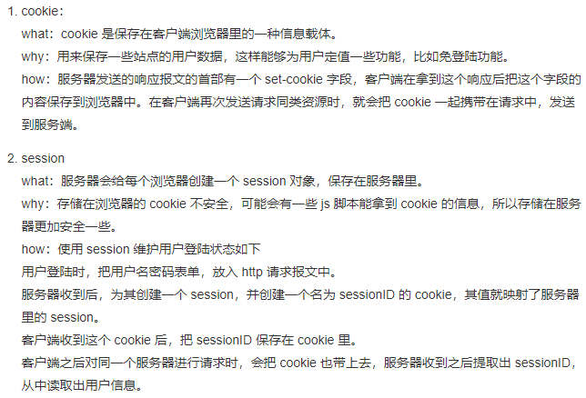
    
    区别：
    
    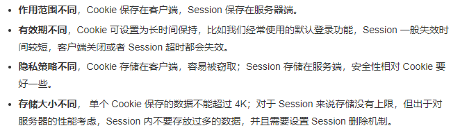
    
16. 什么是ARP协议
    
    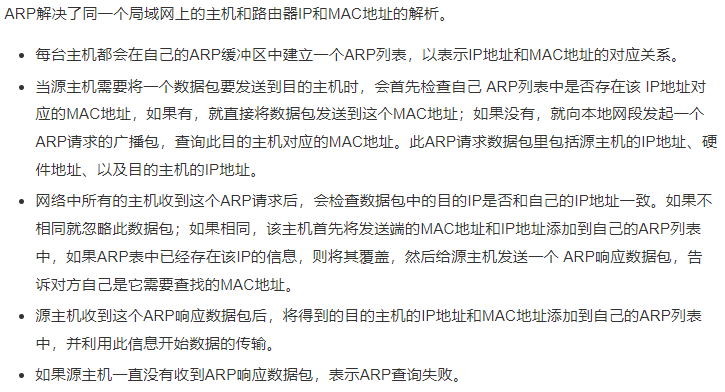
       
17. 什么是XSS攻击

    XSS攻击原理是攻击者向有XSS漏洞的网站中输入恶意的 HTML 代码，当用户浏览该网站时，这段 HTML 代码会自动执行，从而达到攻击的目的。

    例如：
    
    XSS 攻击类似于 SQL 注入攻击，SQL注入攻击中以SQL语句作为用户输入，从而达到查询/修改/删除数据的目的，而在xss攻击中，通过插入恶意脚本，实现对用户游览器的控制，获取用户的一些信息。
        
18. DNS解析过程

    浏览器搜索自己浏览器的DNS缓存

    若没有，则搜索本地操作系统中的DNS缓存和hosts文件
    
    若没有，则操作系统将域名发送至本地域名服务器，本地域名服务器查询自己的DNS缓存，查找成功则返回结果，否则依次向根域名服务器、顶级域名服务器、权限域名服务器发起查询请求，最终返回IP地址给本地域名服务器
    
    本地域名服务器将得到的IP地址返回给操作系统，同时自己也将IP地址缓存起来
    
    操作系统将 IP 地址返回给浏览器，同时自己也将IP地址缓存起来
    
    浏览器得到域名对应的IP地址
    
19. 谈谈IP地址和MAC地址

    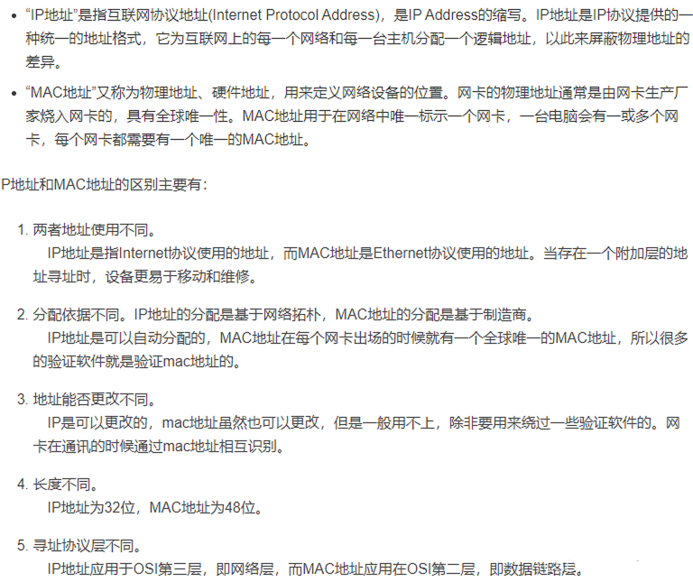   
    
20. TCP流量控制（滑动窗口机制）
    
    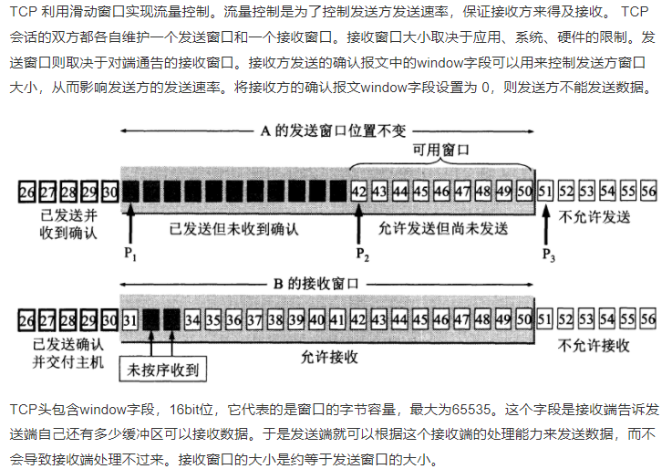

21. TCP阻塞机制
    
    拥塞控制和流量控制不同，前者是一个全局性的过程，而后者指点对点通信量的控制。
    在某段时间，若对网络中某一资源的需求超过了该资源所能提供的可用部分，网络的性能就要变坏。这种情况就叫拥塞。

    拥塞控制就是为了防止过多的数据注入到网络中，这样就可以使网络中的路由器或链路不致于过载。
    拥塞控制所要做的都有一个前提，就是网络能够承受现有的网络负荷。拥塞控制是一个全局性的过程，
    涉及到所有的主机，所有的路由器，以及与降低网络传输性能有关的所有因素。
    相反，流量控制往往是点对点通信量的控制，是个端到端的问题。流量控制所要做到的就是抑制发送端发送数据的速率，以便使接收端来得及接收。
    
    为了进行拥塞控制，TCP 发送方要维持一个拥塞窗口(cwnd)的状态变量。拥塞控制窗口的大小取决于网络的拥塞程度，并且动态变化。
    发送方让自己的发送窗口取为拥塞窗口和接收方的接受窗口中较小的一个。 
    TCP的拥塞控制采用了四种算法，即：**慢开始**、**拥塞避免**、**快重传**和**快恢复**。
    在网络层也可以使路由器采用适当的分组丢弃策略（如：主动队列管理AQM），以减少网络拥塞的发生。
    
    慢开始：慢开始算法的思路是当主机开始发送数据时，如果立即把大量数据字节注入到网络，那么可能会引起网络阻塞，因为现在还不知道网络的符合情况。经验表明，较好的方法是先探测一下，即由小到大逐渐增大发送窗口，也就是由小到大逐渐增大拥塞窗口数值。cwnd初始值为 1，每经过一个传播轮次，cwnd 加倍。
    
    拥塞避免： 拥塞避免算法的思路是让拥塞窗口 cwnd 缓慢增大，即每经过一个往返时间 RTT 就把发送方的 cwnd 加 1。
    
    快重传与快恢复： 在 TCP/IP 中，快速重传和快恢复（FRR）是一种拥塞控制算法，它能快速恢复丢失的数据包。
    
    没有 FRR，如果数据包丢失了，TCP 将会使用定时器来要求传输暂停。在暂停的这段时间内，没有新的或复制的数据包被发送。有了FRR，如果接收机接收到一个不按顺序的数据段，它会立即给发送机发送一个重复确认。如果发送机接收到三个重复确认，它会假定确认件指出的数据段丢失了，并立即重传这些丢失的数据段。有了FRR，就不会因为重传时要求的暂停被耽误。当有单独的数据包丢失时，快速重传和快恢复（FRR）能最有效地工作。当有多个数据信息包在某一段很短的时间内丢失时，它则不能很有效地工作。
    
22. TCP如何保证可靠传输
    
    - 数据包校验：目的是检测数据在传输过程中的任何变化，若校验出包有错，则丢弃报文段并且不给出响应，这时 TCP 发送数据端超时后会重发数据；

    - 对失序数据包重排序：既然 TCP 报文段作为 IP 数据报来传输，而 IP 数据报的到达可能会失序，因此 TCP 报文段的到达也可能会失序。TCP 将对失序数据进行重新排序，然后才交给应用层；
    
    - 丢弃重复数据：对于重复数据，能够丢弃重复数据；
    
    - 应答机制：当 TCP 收到发自 TCP 连接另一端的数据，它将发送一个确认。这个确认不是立即发送，通常将推迟几分之一秒；
    
    - 超时重发：当 TCP 发出一个段后，它启动一个定时器，等待目的端确认收到这个报文段。如果不能及时收到一个确认，将重发这个报文段；
    
    - 流量控制：TCP 连接的每一方都有固定大小的缓冲空间。TCP 的接收端只允许另一端发送接收端缓冲区所能接纳的数据，这可以防止较快主机致使较慢主机的缓冲区溢出，这就是流量控制。TCP 使用的流量控制协议是可变大小的滑动窗口协议。
    
23. HTTP请求转发和重定向的区别
    
    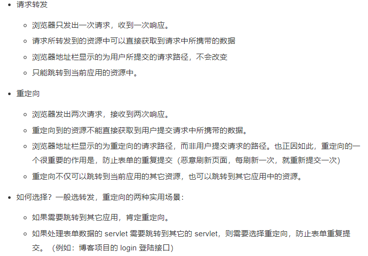
    
24. 什么是DHCP协议
    
    DHCP（动态主机配置协议） 是一个局域网的网络协议。

    指的是由服务器控制一段IP地址范围，给用户提供了即插即用的联网方式，用户不需要再手动配置 IP 地址等信息
    
    该协议自动为用户分配TCP/IP参数信息，如：IP地址，子网掩码，网关等信息。
    
25. 什么是SQL注入
    
    SQL注入就是将原本的SQL语句的逻辑结构改变，使得SQL语句的执行结果和原本开发者的意图不一样；

    比如说我们通过账号密码进行登录，首先需要进行查询判断：
    
    "select * from t_user where name = "张三" and password = "123456"
    
    如果我们把or 1 = 1作为拼接在密码末尾传入进来，执行查询的时候sql会变成
    
    "select * from t_user where name = "张三" and password = "123456" or 1 = 1
    
    密码永远都是成立的，所以，前面无论密码正确与否都会成功登录
    
    我们使用预编译语句就可以避免这个问题，例如：JDBC中的PrepareStatement或MyBatis中#{}
    
    将sql预编译，传参数的时候，不会改变sql语句结构，就可以避免注入。
    
26. URL和URI的区别
    
    URL，统一资源定位符，URL 其实就是我们平时上网时输入的网址，它标识一个互联网资源，并指定对其进行操作或获取该资源的方法。例如
    https://leetcode-cn.com/problemset/all/ 这个 URL，标识一个特定资源并表示该资源的某种形式是可以通过 HTTP 协议从相应位置获得。
    
    URI，统一资源标识符，URL 是 URI 的一个子集，两者都定义了资源是什么，而 URL 还定义了如何能访问到该资源。
    URI 是一种语义上的抽象概念，可以是绝对的，也可以是相对的，而URL则必须提供足够的信息来定位，是绝对的。
    简单地说，只要能唯一标识资源的就是 URI，在 URI 的基础上给出其资源的访问方式的就是 URL。
    
    通俗理解：
    - URI表示的是一个抽象的地址，URL表示的是一个详细的地址。
    - 抽象的地址：辽宁省大连市（这是一个抽象的地址，相当于URI）
    - 详细的地址：辽宁省大连市高新园区软件园B2（这是一个详细的地址，相当于URL）
    - 为什么URL是URI的子集，高新园区软件园B2（URL）属于辽宁省大连市（URI）
    - 那么https://www.csdn.net 是一个URI（URI只指明了服务器的地址，没有具体到文件是什么类型）
    - 那么https://www.csdn.net/image/logo.gif就是一个URL（他具体到了logo文件的位置并且logo文件是gif类型的）
    
27. 粘包和分包
    
    产生原因：
    - 要发送的数据小于TCP发送缓冲区的大小，TCP将多次写入缓冲区的数据一次发送出去，将会发生粘包；
    - 接收数据端的应用层没有及时读取接收缓冲区中的数据，将发生粘包；
    - 要发送的数据大于TCP发送缓冲区剩余空间大小，将会发生拆包；
    - 待发送数据大于MSS（最大报文长度），TCP在传输前将进行拆包。即TCP报文长度-TCP头部长度>MSS。
    
    解决策略：
    - 消息定长。发送端将每个数据包封装为固定长度（不够的可以通过补0填充），这样接收端每次接收缓冲区中读取固定长度的数据就自然而然的把每个数据包拆分开来。
    - 设置消息边界。服务端从网络流中按消息边界分离出消息内容。在包尾增加回车换行符进行分割，例如FTP协议。
    - 将消息分为消息头和消息体，消息头中包含表示消息总长度（或者消息体长度）的字段。
    - 更复杂的应用层协议。
    
28. 什么是阻塞和非阻塞，同步和异步
    
    阻塞和非阻塞：调用者在事件没有发生的时候，一直等待事件发生，不能处理其他任务是阻塞。调用者在事件没有发生的时候，可以去处理别的事务这是非阻塞。

    同步和异步：调用者循环查看事件有没有发生，这种情况是同步。调用者不用自己去查看事件有没有发生，而是等待注册在时间上的回调函数自己通知自己，这是异步。
    
29. HTTP版本区别
    
    HTTP1.0：
    
    - HTTP1.0仅提供了最基本的认证，用户名和密码都未加密（明文）
    
    - HTTP1.0仅支持短连接，每次发送数据都会经过TCP三次握手和四次挥手，效率低
    
    - HTTP1.0只使用了header的if=modified-Since和Expires作为缓存失效的标准
    
    - HTTP1.0不支持端点续传，每次发送数据都会发送全部数据
    
    - HTTP1.0认为每台计算机都只能绑定一个IP地址，不支持虚拟网络
    
    HTTP1.1：
    
    - HTTP1.1使用了摘要算法进行身份验证
    
    - HTTP1.1默认使用长连接：只需要建立一次连接，可以传输多次数据，传输完成之后，只需要一次切断即可。通过请求头的 Connection: keep-alive设置
    
    - HTTP1.1支持端点续传：通过请求头的Range实现
    
    - HTTP1.1使用了虚拟网络：在一台物理服务器上可以存在多个虚拟主机，共享一个IP地址
    
    HTTP2.0：
    
    - HTTP2.0支持头部压缩：利用HPACK算法进行压缩，由于HTTP1.1头部经常出现Cookie、Accept、Sever、Range等字段可能会占用几百到几千字节，而body有时只有几十字节（“头重身轻”）
    
    - HTTP2.0使用二进制格式：HTTP2.0选择了更靠近TCP/IP的二进制格式，抛弃了ASCII码，提高了解析效率
    
    - HTTP2.0强化安全：HTTP2.0一般都跑在HTTPS上
    
    - HTTP2.0多路复用：一个连接上可以有多个请求
    
30. IP地址的分类
    
    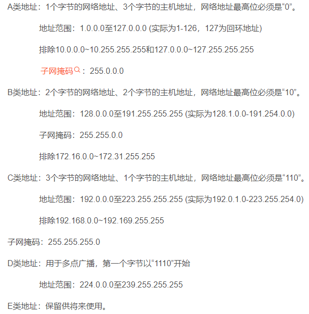
    
31. 