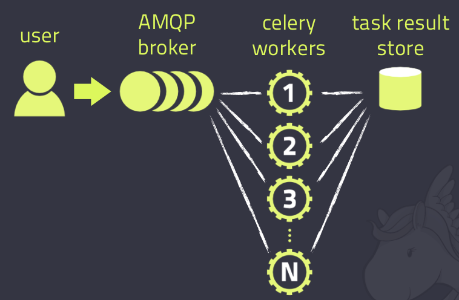
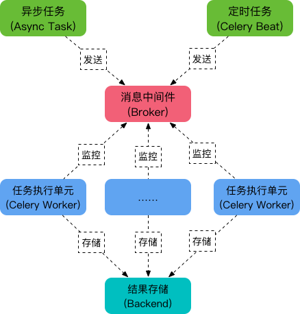

http://t.zoukankan.com/zivli-p-11510418.html
## Celery简介

Celery是一个简单，灵活，可靠的分布式系统，用于处理大量消息，同时为操作提供维护此类系统所需的工具。它是一个任务队列，专注于实时处理，同时还支持任务调度。

**中间人boker**:

 　　broker是一个消息传输的中间件。每当应用程序调用celery的异步任务的时候，会向broker传递消息，而后celery的worker将会取到消息，进行对于的程序执行。其中Broker的中文意思是 经纪人 ，其实就是一开始说的 消息队列 ，用来发送和接受消息。这个Broker有几个方案可供选择：RabbitMQ (消息队列)，Redis（缓存数据库），数据库（不推荐），等等。

**backend**:

 　　通常程序发送的消息，发完就完了，可能都不知道对方时候接受了。为此，celery实现了一个backend，用于存储这些消息以及celery执行的一些消息和结果。Backend是在Celery的配置中的一个配置项 CELERY_RESULT_BACKEND ，作用是保存结果和状态，如果你需要跟踪任务的状态，那么需要设置这一项。可以使用数据库作为backend。


## 特性

高可用: 倘若连接丢失或失败，职程和客户端会自动重试，并且一些中间人通过 主/主 或 主/从 方式复制来提高可用性。

快速: 单个 Celery 进程每分钟可处理数以百万计的任务，而保持往返延迟在亚毫秒级（使用 RabbitMQ、py-librabbitmq 和优化过的设置）。

灵活: Celery 几乎所有部分都可以扩展或单独使用。可以自制连接池、 序列化、压缩模式、日志、调度器、消费者、生产者、自动扩展、 中间人传输或更多。

简单: Celery 易于使用和维护，并且它 不需要配置文件 。 

## 组成

Celery的架构由三部分组成，消息中间件（message broker），任务执行单元（worker）和任务执行结果存储（task result store）组成。





**消息中间件**:

 　Celery本身不提供消息服务，但是可以方便的和第三方提供的消息中间件集成。包括，RabbitMQ, Redis, MongoDB (experimental), Amazon SQS (experimental),CouchDB (experimental), SQLAlchemy (experimental),Django ORM (experimental), IronMQ

**任务执行单元**:

 　Worker是Celery提供的任务执行的单元，worker并发的运行在分布式的系统节点中。

**任务结果存储**:

 　Task result store用来存储Worker执行的任务的结果，Celery支持以不同方式存储任务的结果，包括AMQP, redis，memcached, mongodb，SQLAlchemy, Django ORM，Apache Cassandra, IronCache 等。

## 安装

```
pip3 install celery['redis']
```

## 简单使用

1.目录结构：
```
CeleryTest
　　¦--tasks.py
　　¦--user.py
```

tasks.py
```python
import time
from celery import Celery

app = Celery('tasks', broker='redis://localhost:6379/0')


@app.task
def send(msg):
    print(f'send {msg}')
    time.sleep(3)
    return 
```

user.py
```python
import time
from tasks import send


def register():
    start = time.time()
    send.delay('666')
    print('耗时:', time.time() - start)


if __name__ == '__main__':
    register()
```

2.这里使用redis作borker，启动redis，进入redis目录启动　　
```
$ redis-server
```

3.启动worker，在CeleryTest的同级目录终端输入，—A为Celery实例所在位置
```
$ celery -A tasks worker  -l info
```

4.运行user.py文件，输入如下：
```
耗时: 0.15261435508728027
```

调用 delay 函数即可启动 add 这个任务。这个函数的效果是发送一条消息到broker中去，这个消息包括要执行的函数、函数的参数以及其他信息，具体的可以看 Celery官方文档。这个时候 worker 会等待 broker 中的消息，一旦收到消息就会立刻执行消息。可以看到调用send.delay()后，耗时并没有受到time.sleep()的影响，成功的完成异步调用。我们可以在项目中执行耗时的任务时来使用Celery。这里简单演示并没有使用backend储存任务的结果。

## 使用配置文件

1.目录结构：
```
celery_demo
　　¦--celery_app
　　　　¦--__init__.py
　　　　¦--celeryconfig.py
　　　　¦--task1.py
　　　　¦--task2.py
　　¦--client.py
```

__init__.py
```python
from celery import Celery
app = Celery('demo')                                # 生成实例
app.config_from_object('celery_app.celeryconfig')   # 加载配置
```

celeryconfig.py
```python
BROKER_URL = 'redis://127.0.0.1:6379/0'               # 指定 Broker
CELERY_RESULT_BACKEND = 'redis://127.0.0.1:6379/1'  # 指定 Backend

CELERY_TIMEZONE = 'Asia/Shanghai'                   # 指定时区，默认是 UTC
# CELERY_TIMEZONE='UTC'                             

CELERY_IMPORTS = (                                  # 指定导入的任务模块
    'celery_app.task1',
    'celery_app.task2'
)
```

task1.py
```python
import time
from celery_app import app


@app.task
def add(x, y):
    time.sleep(2)
    return x + y
```

task2.py
```python
import time
from celery_app import app


@app.task
def multiply(x, y):
    time.sleep(2)
    return x * y
```

client.py
```python
from celery_app import task1
from celery_app import task2

res1 = task1.add.delay(2, 8)       # 或者 task1.add.apply_async(args=[2, 8])
res2 = task2.multiply.delay(3, 7)  # 或者 task2.multiply.apply_async(args=[3, 7])
print('hello world')
```

2.启动worker，在celery_demo目录执行下列命令
```
celery_demo $ celery -A celery_app worker -l info
```
接着，运行$ python client.py,它会发送两个异步任务到 Broker，在 Worker 的窗口我们可以看到如下输出：


在前面的例子中，我们使用 delay()或 apply_async()方法来调用任务。事实上，delay 方法封装了 apply_async，如下：
```python
def delay(self, *partial_args, **partial_kwargs):
    """Shortcut to :meth:`apply_async` using star arguments."""
    return self.apply_async(partial_args, partial_kwargs)
```

## 定时任务

Celery 除了可以执行异步任务，也支持执行周期性任务（Periodic Tasks），或者说定时任务。Celery Beat 进程通过读取配置文件的内容，周期性地将定时任务发往任务队列。在上面的例子中，修改配置文件即可实现。

celeryconfig.py
```python
from celery.schedules import crontab
from datetime import timedelta

BROKER_URL = 'redis://127.0.0.1:6379/0'               # 指定 Broker
CELERY_RESULT_BACKEND = 'redis://127.0.0.1:6379/1'  # 指定 Backend

CELERY_TIMEZONE = 'Asia/Shanghai'                   # 指定时区，默认是 UTC
# CELERY_TIMEZONE='UTC'                             

CELERY_IMPORTS = (                                  # 指定导入的任务模块
    'celery_app.task1',
    'celery_app.task2'
)
# schedules
CELERYBEAT_SCHEDULE = {
    'add-every-30-seconds': {
        'task': 'celery_app.task1.add',
        'schedule': timedelta(seconds=30),          # 每 30 秒执行一次
        'args': (5, 8)                              # 任务函数参数
    },
    'multiply-at-some-time': {
        'task': 'celery_app.task2.multiply',
        'schedule': crontab(hour=10, minute=50),    # 每天早上 10 点 50 分执行一次
        'args': (3, 7)                              # 任务函数参数
    }
}
```

2.启动worker，然后定时将任务发送到 Broker，在celery_demo目录下执行下面两条命令：
```
celery -A celery_app worker -l info
celery beat -A celery_app
```

上面两条命令也可以合并为一条：
```
celery -B -A celery_app worker -l info
```