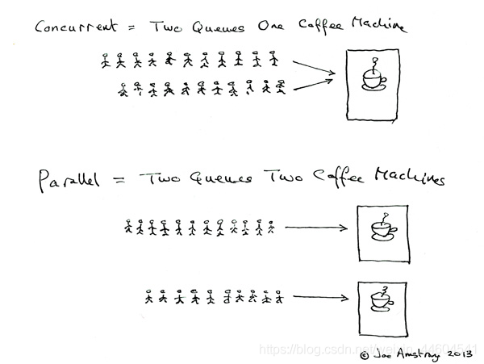
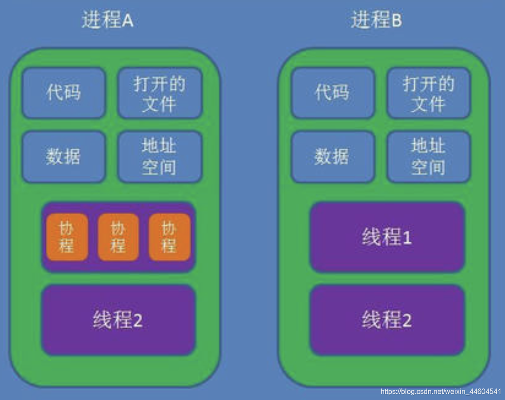

# 基础知识

## 1. 并发和并行

(1) 定义

Erlang 之父 Joe Armstrong 画了一张很可爱的图来解释这两个概念：



+ 并发是两个队列交替使用一台咖啡机
+ 并行是两个队列同时使用两台咖啡机

两个词很好的说明了并发和并行的区别：
+ Parallel Computing：并行计算
+ Concurrent programming：并发编程

(2) 联系

那么并发并行和多进程多线程的关系呢？
+ 多核cpu，多个进程可以并行在多个cpu中计算，当然也会存在进程切换；单核cpu，多个进程在这个单核cpu中是并发运行，根据时间片读取上下文+执行程序+保存上下文。同一个进程同一时间段只能在一个cpu中运行，如果进程数小于cpu数，那么未使用的cpu将会空闲
+ 多核cpu，进程中的多线程并行执行；单核cpu，多线程在单核cpu中并发执行，根据时间片切换线程。同一个线程同一时间段只能在一个cpu内核中运行，如果线程数小于cpu内核数，那么将有多余的内核空闲

场景：
+ 多核CPU——计算密集型任务：尽量使用并行计算，可以提高任务执行效率。计算密集型任务会持续地将CPU占满，此时有越多CPU来分担任务，计算速度就会越快，这是并行的用武之地
+ 单核CPU——计算密集型任务：此时的任务已经把CPU资源100%消耗了，就没必要使用并行计算，毕竟硬件障碍摆在那里
+ 单核CPU——I/O密集型任务：I/O密集型任务在任务执行时需要经常调用磁盘、屏幕、键盘等外设，由于调用外设时CPU会空闲，所以CPU的利用率并不高，此时使用多线程程序，只是便于人机交互。计算效率提升不大。
+ 多核CPU——I/O密集型任务：同单核CPU——I/O密集型任务

总结下：
+ 并行从代码层次上强依赖于多进程/多线程代码，从硬件角度上则依赖于多核CPU
+ 并发是一种现象：同时运行多个程序或多个任务需要被处理的现象，这些任务可能是并行执行的，也可能是串行执行的，和CPU核心数无关，是操作系统进程调度和CPU上下文切换达到的结果

## 2、进程和线程

(1) 定义

1、进程
+ 进程是程序的一次执行过程，是一个动态概念，是程序在执行过程中分配和管理资源的基本单位
+ 在面向线程设计的系统（如当代多数操作系统、Linux 2.6及更新的版本）中，进程本身不是基本运行单位，而是线程的容器
+ 进程拥有自己独立的内存空间，所属线程可以访问进程的空间
+ 程序本身只是指令、数据及其组织形式的描述，进程才是程序的真正运行实例

2、线程
+ 线程是CPU调度和分派的基本单位，它可与同属一个进程的其他的线程共享进程所拥有的全部资源
+ 当前的操作系统是面向线程的，即以线程为基本运行单位，并按线程分配CPU


(2) 联系

线程是进程的一部分，一个线程只能属于一个进程，而一个进程可以有多个线程，且至少有一个线程



区别：理解它们的差别，从资源使用的角度出发。（所谓的资源就是计算机里的中央处理器，内存，文件，网络等等）
+ 根本区别：进程是操作系统资源分配的基本单位，而线程是任务调度和执行的基本单位
+ 在开销方面：每个进程都有独立的代码和数据空间（程序上下文），程序之间的切换会有较大的开销；线程共享代码和数据空间，每个线程都有自己独立的运行栈和程序计数器（PC），线程之间切换的开销小
+ 所处环境：在操作系统中能同时运行多个进程（程序）；而在同一个进程（程序）中有多个线程同时执行（通过CPU调度，在每个时间片中只有一个线程执行）
+ 内存分配方面：系统在运行的时候会为每个进程分配不同的内存空间；而对线程而言，除了CPU外，系统不会为线程分配内存（线程所使用的资源来自其所属进程的资源），线程组之间只能共享资源

包含关系：
+ 没有线程的进程可以看做是单线程的，如果一个进程内有多个线程，则执行过程不是一条线的，而是多条线（线程）共同完成的
+ 线程是进程的一部分，所以线程也被称为轻量级进程

## 3、全局解释器锁GIL

GIL是计算机程序设计语言解释器用于同步线程的一种机制，它使得任何时刻仅有一个线程在执行。即便在多核心处理器上，使用 GIL 的解释器也只允许同一时间执行一个线程

Python的Cpython解释器（普遍使用的解释器）使用GIL（因为Cpython解释器是非线程安全的），在一个Python解释器进程内可以执行多线程程序，但每次一个线程执行时就会获得全局解释器锁，使得别的线程只能等待，由于GIL几乎释放的同时就会被原线程马上获得，那些等待线程可能刚唤醒，所以经常造成线程不平衡享受CPU资源，此时多线程的效率比单线程还要低下

在python的官方文档里，它是这样解释GIL的：
```text
In CPython, the global interpreter lock, or GIL, is a mutex that prevents multiple native threads from executing Python bytecodes at once. This lock is necessary mainly because CPython’s memory management is not thread-safe. (However, since the GIL exists, other features have grown to depend on the guarantees that it enforces.)
```

可以说它的初衷是很好的，为了保证线程间的数据安全性；但是随着时代的发展，GIL却成为了python并行计算的最大障碍，但这个时候GIL已经遍布CPython的各个角落，修改它的工作量太大，特别是对这种开源性的语言来说。但幸好GIL只锁了线程，我们可以再新建解释器进程来实现并行，那这就是multiprocessing的工作了

不同版本的差异：

在python2.x里，GIL的释放逻辑是当前线程遇见IO操作或者ticks计数达到100时进行释放。（ticks可以看作是python自身的一个计数器，专门做用于GIL，每次释放后归零，这个计数可以通过sys.setcheckinterval 来调整）。而每次释放GIL锁，线程进行锁竞争、切换线程，会消耗资源。并且由于GIL锁存在，python里一个进程永远只能同时执行一个线程(拿到GIL的线程才能执行)，这就是为什么在多核CPU上，python的多线程效率并不高。

在python3.x中，GIL不使用ticks计数，改为使用计时器（执行时间达到阈值后，当前线程释放GIL），这样对CPU密集型程序更加友好，但依然没有解决GIL导致的同一时间只能执行一个线程的问题，所以效率依然不尽如人意。
