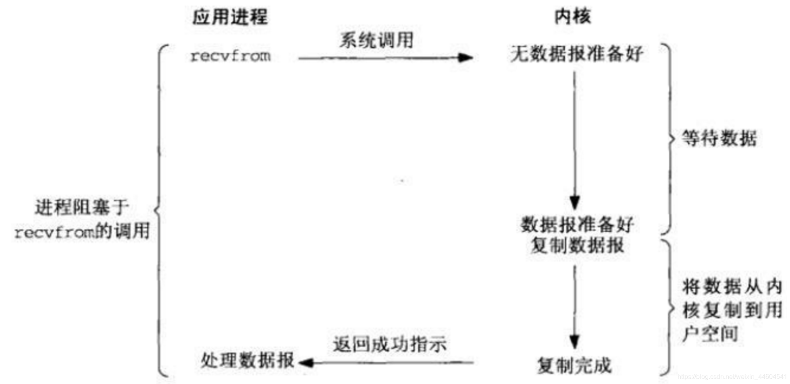
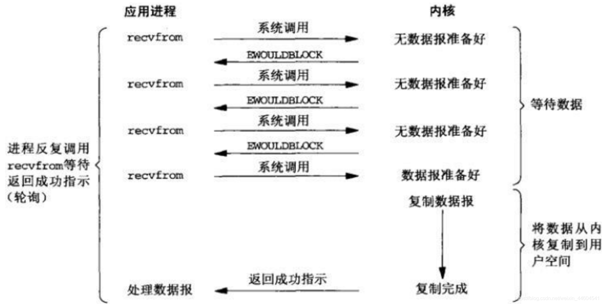
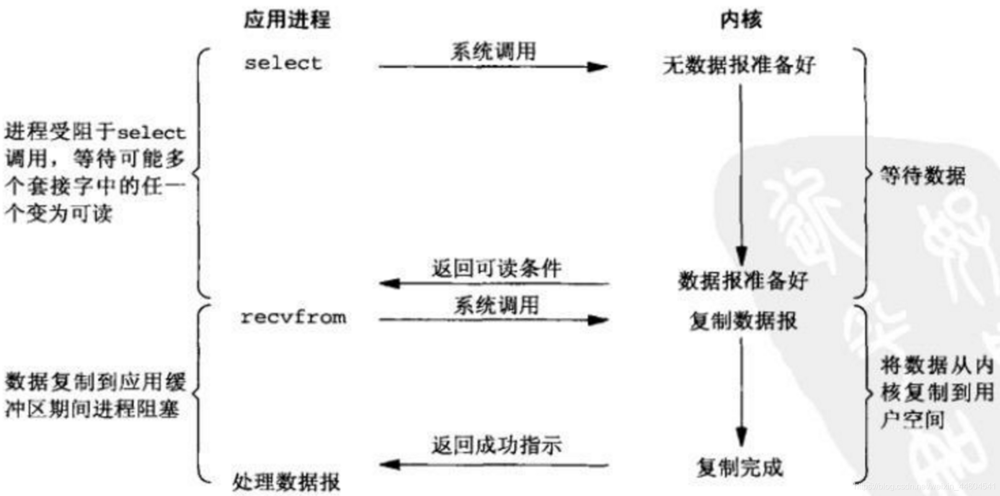
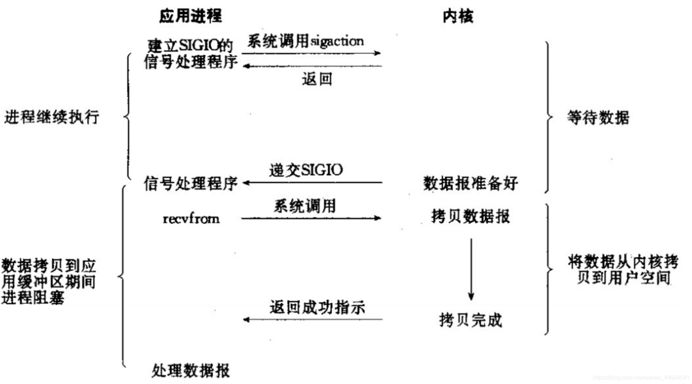
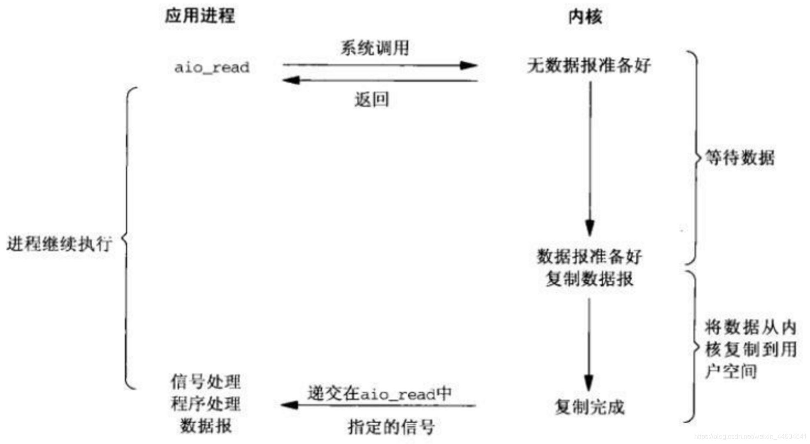
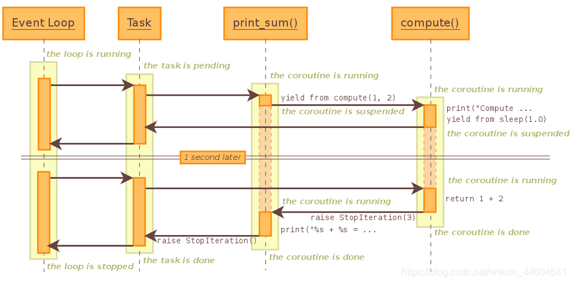

https://fishpond.blog.csdn.net/article/details/117251486

https://blog.csdn.net/weixin_34395205/article/details/85084674

https://zhuanlan.zhihu.com/p/104918655

https://www.dongwm.com/post/80

https://www.dongwm.com/post/83

https://www.dongwm.com/post/84

https://blog.csdn.net/weixin_41599977/article/details/93656042

https://blog.csdn.net/weixin_41599977/article/details/94455367

# 1 生成器

一切还是得从生成器说起，因为asyncio或者大多数协程库内部也是通过生成器实现的

生成器是一次生成一个值的特殊类型函数，可以将其视为可恢复函数，这里就不探究其内部实现原理了

(1) yield

```python
def gen_func():
    yield 1
    yield 2
    yield 3
 
if __name__ == '__main__':
    gen = gen_func()
    for i in gen:
        print(i)
```
上面的例子没有什么稀奇的不是吗？yield像一个特殊的关键字，将函数变成了一个类似于迭代器的对象，可以使用for循环取值。

(2) send, next

协程自然不会这么简单，python协程的目标是星辰大海，从上面的例之所以get不到它的野心，是因为你没有试过send, next两个函数。

首先看next
```python
def gen_func():
    yield 1
    yield 2
    yield 3
 
if __name__ == '__main__':
    gen = gen_func()
    print(next(gen))
    print(next(gen))
    print(next(gen))
```
next的操作有点像for循环，每调用一次next，就会从中取出一个yield出来的值，其实还是没啥特别的，感觉还没有for循环好用。

不过，不知道你有没有想过，如果你只需要一个值，你next一次就可以了，然后你可以去做其他事情，等到需要的时候才回来再次next取值。

就这一部分而言，你也许知道为啥说生成器是可以暂停的了，不过，这似乎也没什么用，那是因为你不知到时，生成器除了可以抛出值，还能将值传递进去。

接下来看send
```python
def gen_func():
    a = yield 1
    print("a: ", a)
    b = yield 2
    print("b: ", b)
    c = yield 3
    print("c: ", c)
    return "finish"
 
if __name__ == '__main__':
    gen = gen_func()
    for i in range(4):
        if i == 0:
            print(gen.send(None))
        else:
            # 因为gen生成器里面只有三个yield，那么只能循环三次。
            # 第四次循环的时候,生成器会抛出StopIteration异常,并且return语句里面内容放在StopIteration异常里面
            try:
                print(gen.send(i))
            except StopIteration as e:
                print("e: ", e)
```
send有着next差不多的功能，不过send在传递一个值给生成器的同时，还能获取到生成器yield抛出的值，在上面的代码中，send分别将None,1,2,3四个值传递给了生成器，之所以第一需要传递None给生成器，是因为规定，之所以规定，因为第一次传递过去的值没有特定的变量或者说对象能接收，所以规定只能传递None, 如果你传递一个非None的值进去，会抛出以下错误:
```text
TypeError: can't send non-None value to a just-started generator
```
从上面的例子我们也发现，生成器里面的变量a,b,c获得了send函数发送来的1, 2, 3.

如果你有事件循环或者说多路复用的经验，你也许能够隐隐察觉到微妙的感觉。

这个微妙的感觉是，是否可以将IO操作yield出来？由事件循环调度, 如果你能get到这个微妙的感觉,那么你已经知道协程高并发的秘密了

(3) yield from

```python
def gen_func():
    a = yield 1
    print("a: ", a)
    b = yield 2
    print("b: ", b)
    c = yield 3
    print("c: ", c)
    return 4
 
def middle():
    gen = gen_func()
    ret = yield from gen
    print("ret: ", ret)
    return "middle Exception"
 
def main():
    mid = middle()
    for i in range(4):
        if i == 0:
            print(mid.send(None))
        else:
            try:
                print(mid.send(i))
            except StopIteration as e:
                print("e: ", e)
 
if __name__ == '__main__':
    main()
```
从上面的代码我们发现,main函数调用的middle函数的send,但是gen_func函数却能接收到main函数传递的值.有一种透传的感觉,这就是yield from的作用, 这很关键。

而yield from最终传递出来的值是StopIteration异常，异常里面的内容是最终接收生成器(本示例是gen_func)return出来的值，所以ret获得了gen_func函数return的4.但是ret将异常里面的值取出之后会继续将接收到的异常往上抛，所以main函数里面需要使用try语句捕获异常。而gen_func抛出的异常里面的值已经被middle函数接收，所以middle函数会将抛出的异常里面的值设为自身return的值。

# 2 IO模型

linux有5种IO模型

(1) 同步IO



同步模型自然是效率最低的模型了，每次只能处理完一个连接才能处理下一个,如果只有一个线程的话, 如果有一个连接一直占用，那么后来者只能傻傻的等了。所以不适合高并发，不过最简单，符合惯性思维

(2) 非阻塞式IO



不会阻塞后面的代码，但是需要不停的显式询问内核数据是否准备好，一般通过while循环，而while循环会耗费大量的CPU。所以也不适合高并发。

(3) 多路复用IO



当前最流行，使用最广泛的高并发方案。

而多路复用又有三种实现方式, 分别是select, poll, epoll：

select,poll由于设计的问题，当处理连接过多会造成性能线性下降，而epoll是在前人的经验上做过改进的解决方案。不会有此问题。

不过select, poll并不是一无是处，假设场景是连接数不多，并且每个连接非常活跃，select，poll是要性能高于epoll的。

(4) 信号驱动式IO



(6) 异步非阻塞IO



理论上比多路复用更快，因为少了一次调用，但是实际使用并没有比多路复用快非常多

# 3 事件循环

IO模型能够解决IO的效率问题，但是实际使用起来需要一个事件循环驱动协程去处理IO。

下面引用官方的一个简单例子：
```python
import selectors
import socket
 
# 创建一个selctor对象
# 在不同的平台会使用不同的IO模型,比如Linux使用epoll, windows使用select(不确定)
# 使用select调度IO
sel = selectors.DefaultSelector()
 
# 回调函数,用于接收新连接
def accept(sock, mask):
    conn, addr = sock.accept()  # Should be ready
    print('accepted', conn, 'from', addr)
    conn.setblocking(False)
    sel.register(conn, selectors.EVENT_READ, read)
 
# 回调函数,用户读取client用户数据
def read(conn, mask):
    data = conn.recv(1000)  # Should be ready
    if data:
        print('echoing', repr(data), 'to', conn)
        conn.send(data)  # Hope it won't block
    else:
        print('closing', conn)
        sel.unregister(conn)
        conn.close()
 
# 创建一个非堵塞的socket
sock = socket.socket()
sock.bind(('localhost', 1234))
sock.listen(100)
sock.setblocking(False)
sel.register(sock, selectors.EVENT_READ, accept)
 
# 一个事件循环,用于IO调度
# 当IO可读或者可写的时候, 执行事件所对应的回调函数
def loop():
    while True:
        events = sel.select()
        for key, mask in events:
            callback = key.data
            callback(key.fileobj, mask)
 
if __name__ == '__main__':
    loop()
```
上面代码中loop函数对应事件循环,它要做的就是一遍一遍的等待IO,然后调用事件的回调函数.

# 4 asyncio库

## 1、asyncio库介绍

asyncio在python3.4被引入标准库，Python 3.5添加了async和await这两个关键字，分别用来替换asyncio.coroutine和yield from，协程成为新的语法，而不再是一种生成器类型了

需要明确一点，asyncio使用**单线程、单个进程**的方式切换；现存的一些库其实并不能原生的支持asyncio（因为会发生阻塞或者功能不可用），比如requests，如果要写爬虫，配合asyncio的应该用aiohttp，其他的如数据库驱动等各种Python对应的库也都得使用对应的aioXXX版本了

几个概念：
+ event_loop 事件循环：相当于一个无限循环，我们可以把一些函数注册到这个事件循环上，当满足条件时，就会调用对应的处理方法。
+ coroutine 协程：协程对象，只一个使用async关键字定义的函数，他的调用不会立即执行函数，而是会返回一个协程对象。协程对象需要注册到事件循环中，由事件循环调用。
+ task 任务：一个协程对象就是一个原生可以挂起的函数，任务则是对协程的进一步封装，其中包含任务的各种状态。
+ future：代表将来执行或没有执行的任务结果。它与task没有本质的区别。
+ async/await 关键字：python3.5用于定义协程的关键字，async定义一个协程，await用于挂起阻塞的异步调用接口。

运行的序列图
```python
import asyncio

async def compute(x, y):
    print('Compute {} + {} ...'.format(x, y))
    await asyncio.sleep(1.0)
    return x + y


async def print_sum(x, y):
    result = await compute(x, y)
    print('{} + {} = {}'.format(x, y, result))


loop = asyncio.get_event_loop()
loop.run_until_complete(print_sum(1, 2))
loop.close()
```



## 2、asyncio的使用

(1) 定义一个协程

通过async定义一个协程，协程是一个对象，不能直接运行，需要把协程加入到事件循环（loop）中，由loop在适当的时候调用协程

asyncio.get_event_loop()方法可以创建一个事件循环，然后由run_until_complete(协程对象)将协程注册到事件循环中，并启动事件循环

run_until_complete根据传递的参数的不同，返回的结果也有所不同：
+ run_until_complete()传递的是一个协程对象或task对象，则返回他们finished的返回结果（前提是他们得有return的结果，否则返回None）
+ run_until_complete(asyncio.wait(多个协程对象或任务))，函数会返回一个元组包括（done, pending），通过访问done里的task对象，获取返回值
+ run_until_complete(asyncio.gather(多个协程对象或任务))，函数会返回一个列表，列表里面包括各个任务的返回结果，按顺序排列

python 3.7 以前的版本调用异步函数的步骤：
+ 调用asyncio.get_event_loop()函数获取事件循环loop对象
+ 通过不同的策略调用loop.run_forever()方法或者loop.run_until_complete()方法执行异步函数

python3.7 以后的版本使用asyncio.run即可。此函数总是会创建一个新的事件循环并在结束时关闭之。它应当被用作 asyncio 程序的主入口点，理想情况下应当只被调用一次。
```python
import asyncio
 
async def work(x):  # 通过async关键字定义一个协程
    for _ in range(3):
        print('Work {} is running ..'.format(x))

coroutine_1 = work(1)  # 协程是一个对象，不能直接运行

# 3.5<version<3.7：
loop = asyncio.get_event_loop()  # 创建一个事件循环
result = loop.run_until_complete(coroutine_1)  # 将协程对象加入到事件循环中，并执行
print(result)  # 协程对象并没有返回结果，打印None
# version≥3.7：
# asyncio.run(coroutine_1)  #创建一个新的事件循环，并以coroutine_1为程序的主入口，执行完毕后关闭事件循环
```

(2) 创建一个task

协程对象不能直接运行，在注册到事件循环的时候，其实是run_until_complete方法将协程包装成一个task对象，所谓的task对象就是Future类的子类，它保存了协程运行后的状态，用于未来获取协程的结果。

创建task后，task在加入事件循环之前是pending状态，因为下例中没有耗时操作，task很快会完成，后面打印finished状态。
```python
import asyncio

async def work(x):  # 通过async关键字定义一个协程
    for _ in range(3):
        print('Work {} is running ..'.format(x))

coroutine_1 = work(1)  # 协程是一个对象，不能直接运行
 
loop = asyncio.get_event_loop()
task = loop.create_task(coroutine_1)
# task = asyncio.ensure_future(coroutine_1)  # 这样也能创建一个task
print(task)
loop.run_until_complete(task)  # run_until_complete接受的参数是一个future对象，当传人一个协程时，其内部自动封装成task
print(task)
```
(3) 绑定回调

在task执行完毕的时候可以获取执行的结果，回调的最后一个参数是future对象，通过这个对象可以获取协程的返回值，如果回调函数需要多个参数，可以通过偏函数导入。

从下例可以看出，coroutine执行结束时候会调用回调函数，并通过future获取协程返回（return）的结果。我们创建的task和回调里面的future对象，实际上是同一个对象。
```python
import asyncio

async def work(x):
    for _ in range(3):
        print('Work {} is running ..'.format(x))
    return "Work {} is finished".format(x)

def call_back(future):
    print("Callback: {}".format(future.result()))
    
coroutine = work(1)
loop = asyncio.get_event_loop()
task = asyncio.ensure_future(coroutine)
task.add_done_callback(call_back)
loop.run_until_complete(task)  # 返回任务的结果
```
当回调函数需要传递多个参数时，可以使用functools里的partial方法（偏函数导入这些参数）

functools.partial(func, * args, * * keywords)，函数装饰器，返回一个新的partial对象。调用partial对象和调用被修饰的函数func相同，只不过调用partial对象时传入的参数个数通常要少于调用func时传入的参数个数。当一个函数func可以接收很多参数，而某一次使用只需要更改其中的一部分参数，其他的参数都保持不变时，partial对象就可以将这些不变的对象冻结起来，这样调用partial对象时传入未冻结的参数，partial对象调用func时连同已经被冻结的参数一同传给func函数，从而可以简化调用过程
```python
import asyncio
import functools

async def work(x):
    for _ in range(3):
        print('Work {} is running ..'.format(x))
    return "Work {} is finished".format(x)

    
def call_back_2(num, future):
    print("Callback_2: {}, the num is {}".format(future.result(), num))
    
coroutine = work(1)
loop = asyncio.get_event_loop()
task = asyncio.ensure_future(coroutine)
task.add_done_callback(functools.partial(call_back_2, 100))
loop.run_until_complete(task)
```

(4) 阻塞和await

使用async可以定义协程对象，使用await可以正对耗时操作进行挂起，就像生成器里的yield一样，函数让出控制权。

协程遇到await，事件循环就会挂起这个协程，执行别的协程，直到其他协程也挂起或执行完毕，在进行下一个协程的执行。

如果一个对象可以在 await 语句中使用，那么它就是 可等待 对象。
```python
import asyncio
import time

async def work(delay, msg):
    print(f"Task receives the message :'{msg}' ")
    await asyncio.sleep(delay)
    print(msg)

async def main():
    print(f"Started at {time.strftime('%X')}")
    await work(1, "hello")  # 启动一个协程，但是这是同步执行的
    await work(2, "world")
    print(f"Finished at time {time.strftime('%X')}")

asyncio.run(main())
# 运行结果：
# 先打印print(f"Task receives the message :'{msg}' ")然后等待1秒后打印“hello”，
# 然后再次打印print(f"Task receives the message :'{msg}' ")等待2秒后打印“world”
```
简单的说，await就是挂起当前任务，去执行其他任务，此时是堵塞的，必须要等其他任务执行完毕才能返回到当前任务继续往下执行，这样的说的前提是，在一个时间循环中有多个task或future，当await右面等待的对象是协程对象时，就没有了并发的作用，就是堵塞等待这个协程对象完成

(5) 协程嵌套

使用async可以定义协程，协程用于耗时的IO操作。我们也可以封装更多的IO操作过程，在一个协程中await另外一个协程，实现协程的嵌套。
```python
import asyncio

async def work(x):
    for _ in range(3):
        print("Work {} is running ..".format(x))
        await asyncio.sleep(1)  # 当执行某个协程时，在任务阻塞的时候用await挂起
    return "Work {} is finished!".format(x)

async def main_work():
    coroutine_1 = work(1)
    coroutine_2 = work(2)
    coroutine_3 = work(3)
    
    tasks = [
        asyncio.ensure_future(coroutine_1),
        asyncio.ensure_future(coroutine_2),
        asyncio.ensure_future(coroutine_3),
    ]
    
    dones, pendings = await asyncio.wait(tasks)
    
    for task in dones:
        print("The task's result is : {}".format(task.result()))
        
if __name__ == "__main__":
    loop = asyncio.get_event_loop()
    loop.run_until_complete(main_work())
```

运行结果
```text
Work 1 is running ..
Work 2 is running ..
Work 3 is running ..
Work 1 is running ..
Work 2 is running ..
Work 3 is running ..
Work 1 is running ..
Work 2 is running ..
Work 3 is running ..
The task's result is : Work 2 is finished!
The task's result is : Work 3 is finished!
The task's result is : Work 1 is finished!
```

(6) 一个例子
```python
import asyncio

async def nested1():
    print("nested1")
    await asyncio.sleep(0.5)
    print("nested1 is finished!")
    return 1

async def nested2():
    print("nested2")
    await asyncio.sleep(0.5)
    print("nested2 is finished!")
    return 2

async def nested3():
    print("nested3")
    await asyncio.sleep(0.5)
    print("nested3 is finished!")
    return 3

async def nested4():
    print("nested4")
    await asyncio.sleep(0.5)
    print("nested4 is finished!")
    return 4

async def main():
    # Schedule nested() to run soon concurrently
    # with "main()".
    print("main")

    task1 = asyncio.create_task(nested1())  # 使用asyncio.create_task将函数打包成一个任务，该协程将自动排入日程等待运行
    task2 = asyncio.create_task(nested2())
    task3 = asyncio.create_task(nested3())
    task4 = asyncio.create_task(nested4())
    
    await asyncio.sleep(1)  # 在main这个协程中，碰到耗时操作，则挂起任务，执行其他任务，即：task1 or task2 or task3 or task4
    
    # "task" can now be used to cancel "nested()", or
    # can simply be awaited to wait until it is complete:
    print(await task1)  # 等待 task1 如果task1中存在耗时操作，则挂起
    print(await task2)
    print(await task3)
    print(await task4)

asyncio.run(main())  # 并发运行这个5个协程，运行最高层级的入口点main函数
```

## 3 同步机制

（1）Semaphore（信号量）

比如现在要抓取http://httpbin.org/get?a=X这样的页面，X为1-10000的数字，一次性的产生1w次请求显然很快就会被封掉。那么我们可以用Semaphore控制同时的并发量(例子中为了演示，X为0-11)：
```python
import aiohttp
import asyncio

NUMBERS = range(12)
URL = 'http://httpbin.org/get?a={}'
sema = asyncio.Semaphore(3)


async def fetch_async(a):
    async with aiohttp.request('GET', URL.format(a)) as r:
        data = await r.json()
    return data['args']['a']


async def print_result(a):
    with (await sema):
        r = await fetch_async(a)
        print('fetch({}) = {}'.format(a, r))


loop = asyncio.get_event_loop()
f = asyncio.wait([print_result(num) for num in NUMBERS])
loop.run_until_complete(f)
```
在运行的时候可以感受到并发受到了信号量的限制，基本保持在同时处理三个请求的标准。

（2）Lock（锁）

看下面的例子：
```python
import asyncio
import functools


def unlock(lock):
    print('callback releasing lock')
    lock.release()


async def test(locker, lock):
    print('{} waiting for the lock'.format(locker))
    with await lock:
        print('{} acquired lock'.format(locker))
    print('{} released lock'.format(locker))


async def main(loop):
    lock = asyncio.Lock()
    await lock.acquire()
    loop.call_later(0.1, functools.partial(unlock, lock))
    await asyncio.wait([test('l1', lock), test('l2', lock)])

loop = asyncio.get_event_loop()
loop.run_until_complete(main(loop))
loop.close()

```
这个例子中我们首先使用 acquire 加锁，通过 call_later 方法添加一个 0.1 秒后释放锁的函数。看一下调用：
```text
l1 waiting for the lock
l2 waiting for the lock
callback releasing lock
l1 acquired lock
l1 released lock
l2 acquired lock
l2 released lock
```

（3）Condition（条件）
```python
import asyncio


async def consumer(cond, name, second):
    await asyncio.sleep(second)
    with await cond:
        await cond.wait()
        print('{}: Resource is available to consumer'.format(name))


async def producer(cond):
    await asyncio.sleep(2)
    for n in range(1, 3):
        with await cond:
            print('notifying consumer {}'.format(n))
            cond.notify(n=n)
        await asyncio.sleep(0.1)

async def producer2(cond):
    await asyncio.sleep(2)
    with await cond:
        print('Making resource available')
        cond.notify_all()

async def main(loop):
    condition = asyncio.Condition()

    task = loop.create_task(producer(condition))
    consumers = [consumer(condition, name, index)
                 for index, name in enumerate(('c1', 'c2'))]
    await asyncio.wait(consumers)
    task.cancel()

    task = loop.create_task(producer2(condition))
    consumers = [consumer(condition, name, index)
                 for index, name in enumerate(('c1', 'c2'))]
    await asyncio.wait(consumers)
    task.cancel()


loop = asyncio.get_event_loop()
loop.run_until_complete(main(loop))
loop.close()
```

这次演示了 2 种通知的方式：
+ 使用 notify 方法挨个通知单个消费者
+ 使用 notify_all 方法一次性的通知全部消费者

由于 producer 和 producer2 是异步的函数，所以不能使用之前 call_later 方法，需要用 create_task 把它创建成一个任务（Task）。但是最后记得要把任务取消掉。

执行以下看看效果：
```text
notifying consumer 1
c1: Resource is available to consumer
notifying consumer 2
c2: Resource is available to consumer
Making resource available
c1: Resource is available to consumer
c2: Resource is available to consumer
```

（4）Event（事件）

模仿锁的例子实现：
```python
import asyncio
import functools


def set_event(event):
    print('setting event in callback')
    event.set()


async def test(name, event):
    print('{} waiting for event'.format(name))
    await event.wait()
    print('{} triggered'.format(name))


async def main(loop):
    event = asyncio.Event()
    print('event start state: {}'.format(event.is_set()))
    loop.call_later(
        0.1, functools.partial(set_event, event)
    )
    await asyncio.wait([test('e1', event), test('e2', event)])
    print('event end state: {}'.format(event.is_set()))

loop = asyncio.get_event_loop()
loop.run_until_complete(main(loop))
loop.close()
```
看起来也确实和锁的意思很像，不同的是，事件被触发时，2 个消费者不用获取锁就要尽快的执行下去了。

（5）Queue

在 asyncio 官网上已经举例了 2 个很好的 队列例子 了，这文就不重复了。asyncio 同样支持 LifoQueue 和 PriorityQueue，我们体验下 aiohttp + 优先级队列的用法吧：
```python
import asyncio
import random
import aiohttp

NUMBERS = random.sample(range(100), 7)
URL = 'http://httpbin.org/get?a={}'
sema = asyncio.Semaphore(3)


async def fetch_async(a):
    async with aiohttp.request('GET', URL.format(a)) as r:
        data = await r.json()
    return data['args']['a']


async def collect_result(a):
    with (await sema):
        return await fetch_async(a)


async def produce(queue):
    for num in NUMBERS:
        print('producing {}'.format(num))
        item = (num, num)
        await queue.put(item)


async def consume(queue):
    while 1:
        item = await queue.get()
        num = item[0]
        rs = await collect_result(num)
        print('consuming {}...'.format(rs))
        queue.task_done()


async def run():
    queue = asyncio.PriorityQueue()
    consumer = asyncio.ensure_future(consume(queue))
    await produce(queue)
    await queue.join()
    consumer.cancel()


loop = asyncio.get_event_loop()
loop.run_until_complete(run())
loop.close()
```
看到使用了新的 ensure_future 方法，其实它和之前说的 create_task 意思差不多，都是为了把一个异步的函数变成一个协程的 Task。它们的区别是：
+ create_task 是 AbstractEventLoop 的抽象方法，不同的 loop 可以实现不同的创建 Task 方法，这里用的是 BaseEventLoop 的实现。
+ ensure_future 是 asyncio 封装好的创建 Task 的函数，它还支持一些参数，甚至指定 loop。一般应该使用它，除非用到后面提到的 uvloop 这个第三方库。

这个例子中，首先我们从 0-99 中随机取出 7 个数字，放入优先级队列，看看消费者是不是按照从小到大的顺序执行的呢？
```text
producing 6
producing 4
producing 22
producing 48
producing 9
producing 90
producing 40
consuming 4...
consuming 6...
consuming 9...
consuming 22...
consuming 40...
consuming 48...
consuming 90...
```

## 4、一些函数和接口

(1) 并发运行任务
```text
asyncio.gather（* aws，loop = None，return_exceptions = False ）
```

同时在aws 序列中运行等待对象：
+ 如果在aws中等待的是协程，它将自动调度为任务。
+ 如果所有等待都成功完成，则结果是返回值的汇总列表。结果值的顺序对应于aws中的等待顺序。
+ 如果return_exceptions是False（默认），则第一个引发的异常会立即传播到等待的任务gather()。aws序列 中的其他等待项将不会被取消并继续运行。
+ 如果return_exceptions是True，异常的处理方式一样成功的结果，并在结果列表汇总。
+ 如果gather()被取消，所有提交的awaitables（尚未完成）也被取消。
+ 如果aws序列中的任何任务或未来被取消，则将其视为已引发CancelledError- 在这种情况下不会取消gather() 呼叫。这是为了防止取消一个提交的任务/未来以导致其他任务/期货被取消。

```python
# 并发运行任务的案例
import asyncio

async def factorial(name, number):
    f = 1
    for i in range(2, number + 1):
        print(f"Task {name}: Compute factorial({i})...")  # python3.7新语法，了解一波
        await asyncio.sleep(1)  # await后面是 可等待对象
        f *= i
    print(f"Task {name}: factorial({number}) = {f}")
    
    return f"Task {name}: Finished!"

async def main():
    # Schedule three calls *concurrently*:
    results = await asyncio.gather(  # results包含所有任务的返回结果，是一个列表，按执行顺序返回结果
        factorial("A", 2),  # 协程，会自动调度为任务
        factorial("B", 3),
        factorial("C", 4),
    )
    print(results)

asyncio.run(main())  # 协程的嵌套，后面有详解
```

(2) 屏蔽取消操作
```text
asyncio.shield(aw, * , loop=None)
```

保护一个 可等待对象 防止其被 取消。如果 aw 是一个协程，它将自动作为任务加入日程。
+ res = await shield(something()) 相当于: res = await something()
不同之处 在于如果包含它的协程被取消，在 something() 中运行的任务不会被取消。从 something() 的角度看来，取消操作并没有发生。然而其调用者已被取消，因此 “await” 表达式仍然会引发 CancelledError。
+ 如果通过其他方式取消 something() (例如在其内部操作) 则 shield() 也会取消。
+ 如果希望完全忽略取消操作 (不推荐) 则 shield() 函数需要配合一个 try/except 代码段，如下所示:   
```text
try:
    res = await shield(something())
except CancelledError:
    res = None
```

(3) 超时
```text
asyncio.wait_for(aw, timeout, * , loop=None) 
```

等待 aw 可等待对象 完成，指定 timeout 秒数后超时。
+ 如果 aw 是一个协程，它将自动作为任务加入日程。
+ timeout 可以为 None，也可以为 float 或 int 型数值表示的等待秒数。如果 timeout 为 None，则等待直到完成。
+ 如果发生超时，任务将取消并引发 asyncio.TimeoutError.
+ 要避免任务 取消，可以加上 shield()。函数将等待直到目标对象确实被取消，所以总等待时间可能超过 timeout 指定的秒数。如果等待被取消，则 aw 指定的对象也会被取消。
+ loop 参数已弃用，计划在 Python 3.10 中移除

```python
# 超时的案例
import asyncio

async def eternity():
    # Sleep for one hour
    # await asyncio.sleep(0.5)
    await asyncio.sleep(3600)
    print('yay!')

async def main():
    # Wait for at most 1 second
    try:
        await asyncio.wait_for(eternity(), timeout=1.0)  # 等待 可等待对象 完成，超过timeout秒后，抛出asyncio.TimeoutError异常
    except asyncio.TimeoutError:
        print('timeout!')

asyncio.run(main())
```

```python
# 使用事件循环和asyncio.wait、asyncio.gather实现并发运行任务
import asyncio
import time

async def work_1(x):
    print(f"Starting {x}")
    time.sleep(1)
    print(f"Starting {x}")
    for _ in range(3):
        print(f"Work {x} is running ..")
        await asyncio.sleep(2)  # 耗时操作，此时挂起该协程，执行其他协程
    return f"Work {x} is finished"

async def work_2(x):
    print(f"Starting {x}")
    for _ in range(3):
        await asyncio.sleep(1)  # 耗时操作，此时挂起该协程，执行其他协程
        print(f"Work {x} is running ..")
    return f"Work {x} is finished"

coroutine_1 = work_1(1)
coroutine_2 = work_2(2)

loop = asyncio.get_event_loop()  # 创建一个事件循环

# 方式一，asyncio.wait(tasks)接受一个task列表  执行的顺序与列表里的任务顺序有关
tasks = [
    asyncio.ensure_future(coroutine_1),
    asyncio.ensure_future(coroutine_2),
]
# 注册到事件循环中，并执行
dones, pendings = loop.run_until_complete(asyncio.wait(tasks))  # loop.run_until_complete(asyncio.wait(tasks))的作用相当于：await asyncio.wait(tasks)
for task in dones:
    print(task.result())

# 方式二，使用asyncio.gather(*tasks)，接受一堆tasks，tasks也可以是一个列表，使用*解包
# task_1 = asyncio.ensure_future(coroutine_1)
# task_2 = asyncio.ensure_future(coroutine_2)
# task_result_list = loop.run_until_complete(asyncio.gather(task_1, task_2))  # 返回一个列表，里面包含所有task的result()的结果
# print(task_result_list)
```

(4) 简单等待
```text
asyncio.wait（aws，* , loop = None，timeout = None，return_when = ALL_COMPLETED ）
```
同时运行aws中的等待对象 并阻塞 ，直到return_when指定的条件。
+ 返回两组tasks/futures：（done，pending）
+ 用法：done, pending = await asyncio.wait(aws)
+ return_when 指定此函数应在何时返回。它必须为以下常数之一:
    + FIRST_COMPLETED 函数将在任意可等待对象结束或取消时返回。
    + FIRST_EXCEPTION 函数将在任意可等待对象因引发异常而结束时返回。当没有引发任何异常时它就相当于 ALL_COMPLETED。
    + ALL_COMPLETED 函数将在所有可等待对象结束或取消时返回。
    + 与 wait_for() 不同，wait() 在超时发生时不会取消可等待对象

```python
# 简单等待的案例
import asyncio

async def foo():
    return 42

task = asyncio.create_task(foo())
# 注意：1、这里传递的要是一个任务组，而不能是单个task，如果只有一个任务，可以这样传递：[task](task,){task}
#       2、直接传递协程对象的方式已弃用 即：done, pending = await asyncio.wait([foo()])
done, pending = await asyncio.wait((task, ))

if task in done:
    print(f"The task's result is {task.result()}")
```

(5) as_completed
```text
asyncio.as_completed(aws, * , loop=None, timeout=None) 
```
并发地运行 aws 集合中的 可等待对象。返回一个 Future 对象的迭代器。返回的每个 Future 对象代表来自剩余可等待对象集合的最早结果。

如果在所有 Future 对象完成前发生超时则将引发 asyncio.TimeoutError
```python
# 使用as_completed方法
import asyncio

async def work(x):
    for _ in range(3):
        print("Work {} is running ..".format(x))
        await asyncio.sleep(1)  # 当执行某个协程时，在任务阻塞的时候用await挂起
    return "Work {} is finished!".format(x)

async def main_work():
    coroutine_1 = work(1)
    coroutine_2 = work(2)
    coroutine_3 = work(3)
    
    tasks = [
        asyncio.ensure_future(coroutine_2),
        asyncio.ensure_future(coroutine_1),
        asyncio.ensure_future(coroutine_3),
    ]

    for task in asyncio.as_completed(tasks):  # 返回一个可迭代对象，每次返回最先完成的任务的结果
        result = await task
        print(f"The task's result is : {result}")
        
if __name__ == "__main__":
    loop = asyncio.get_event_loop()
    loop.run_until_complete(main_work())
```