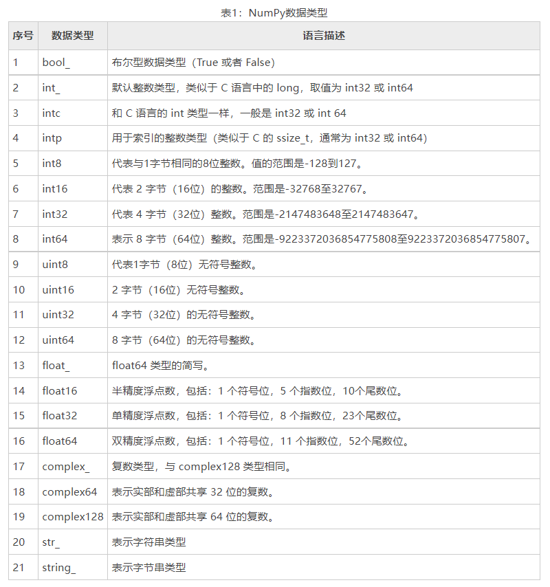
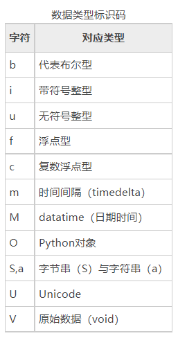

# NumPy数据类型



## 数据类型对象
数据类型对象（Data Type Object）又称 dtype 对象，主要用来描述数组元素的数据类型、大小以及字节顺序。同时，它也可以用来创建结构化数据。
比如常见的 int64、float32 都是 dtype 对象的实例，其语法格式如下：
```
np.dtype(object)
```
示例：
```python
import numpy as np 

a= np.dtype(np.int64) 
print(a)  
```

## 数据类型标识码
NumPy 中每种数据类型都有一个唯一标识的字符码，如下所示：



下面使用数据类型标识码，创建一组结构化数据：
```python
import numpy as np

dt = np.dtype([('score','i1')])
print(dt) 
```

将上述的数据类型对象 dt，应用到 ndarray 中：
```python
import numpy as np

dt = np.dtype([('score','i1')])
a = np.array([(55,),(75,),(85,)], dtype = dt)
print(a)
print(a.dtype)
print(a['score'])
```

## 定义结构化数据
通常情况下，结构化数据使用字段的形式来描述某个对象的特征。
以下示例描述一位老师的姓名、年龄、工资的特征，该结构化数据其包含以下字段：
+ str 字段：name
+ int 字段：age
+ float 字段：salary

```python
import numpy as np

teacher = np.dtype([('name','S20'), ('age', 'i1'), ('salary', 'f4')])
print(teacher)

b = np.array([('ycs', 32, 6357.50),('jxe', 28, 6856.80)], dtype = teacher) 
print(b)
```
