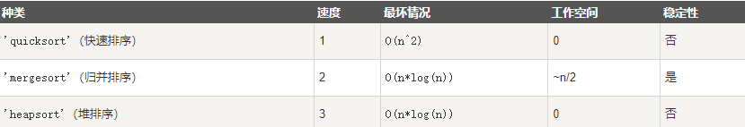

# NumPy 排序、条件刷选函数
NumPy 提供了多种排序的方法。 这些排序函数实现不同的排序算法，每个排序算法的特征在于执行速度，最坏情况性能，所需的工作空间和算法的稳定性。 下表显示了三种排序算法的比较。



## numpy.sort()
numpy.sort() 函数返回输入数组的排序副本。函数格式如下：
```
numpy.sort(a, axis, kind, order)
```
参数说明：
+a: 要排序的数组
+axis: 沿着它排序数组的轴，如果没有数组会被展开，沿着最后的轴排序， axis=0 按列排序，axis=1 按行排序
+kind: 默认为'quicksort'（快速排序）
+order: 如果数组包含字段，则是要排序的字段
```python
import numpy as np  
 
a = np.array([[3,7],[9,1]])  
print ('我们的数组是：')
print (a)
print ('\n')
print ('调用 sort() 函数：')
print (np.sort(a))
print ('\n')
print ('按列排序：')
print (np.sort(a, axis =  0))
print ('\n')
# 在 sort 函数中排序字段 
dt = np.dtype([('name',  'S10'),('age',  int)]) 
a = np.array([("raju",21),("anil",25),("ravi",  17),  ("amar",27)], dtype = dt)  
print ('我们的数组是：')
print (a)
print ('\n')
print ('按 name 排序：')
print (np.sort(a, order =  'name'))
```

## numpy.argsort()
numpy.argsort() 函数返回的是数组值从小到大的索引值。
```python
import numpy as np 
 
x = np.array([3,  1,  2])  
print ('我们的数组是：')
print (x)
print ('\n')
print ('对 x 调用 argsort() 函数：')
y = np.argsort(x)  
print (y)
print ('\n')
print ('以排序后的顺序重构原数组：')
print (x[y])
print ('\n')
print ('使用循环重构原数组：')
for i in y:  
    print (x[i], end=" ")
```

## numpy.lexsort()
numpy.lexsort() 用于对多个序列进行排序。把它想象成对电子表格进行排序，每一列代表一个序列，排序时优先照顾靠后的列。

这里举一个应用场景：小升初考试，重点班录取学生按照总成绩录取。在总成绩相同时，数学成绩高的优先录取，在总成绩和数学成绩都相同时，按照英语成绩录取…… 这里，总成绩排在电子表格的最后一列，数学成绩在倒数第二列，英语成绩在倒数第三列。
```python
import numpy as np 
 
nm =  ('raju','anil','ravi','amar') 
dv =  ('f.y.',  's.y.',  's.y.',  'f.y.') 
ind = np.lexsort((dv,nm))  
print ('调用 lexsort() 函数：') 
print (ind) 
print ('\n') 
print ('使用这个索引来获取排序后的数据：') 
print ([nm[i]  +  ", "  + dv[i]  for i in ind])
```
上面传入 np.lexsort 的是一个tuple，排序时首先排 nm，顺序为：amar、anil、raju、ravi 。综上排序结果为 [3 1 0 2]。

## msort、sort_complex、partition、argpartition
+ msort(a)	数组按第一个轴排序，返回排序后的数组副本。np.msort(a) 相等于 np.sort(a, axis=0)。
+ sort_complex(a)	对复数按照先实部后虚部的顺序进行排序。
+ partition(a, kth[, axis, kind, order])	指定一个数，对数组进行分区
+ argpartition(a, kth[, axis, kind, order])	可以通过关键字 kind 指定算法沿着指定轴对数组进行分区

复数排序：
```python
import numpy as np

print(np.sort_complex([5, 3, 6, 2, 1]))
print(np.sort_complex([1 + 2j, 2 - 1j, 3 - 2j, 3 - 3j, 3 + 5j]))
```

partition() 分区排序：
```python
>>> import numpy as np
>>> a = np.array([3, 4, 2, 1])
>>> np.partition(a, 3)  # 将数组 a 中所有元素（包括重复元素）从小到大排列，3 表示的是排序数组索引为 3 的数字，比该数字小的排在该数字前面，比该数字大的排在该数字的后面
array([2, 1, 3, 4])
>>>
>>> np.partition(a, (1, 3)) # 小于 1 的在前面，大于 3 的在后面，1和3之间的在中间
array([1, 2, 3, 4])
```

找到数组的第 3 小（index=2）的值和第 2 大（index=-2）的值:
```python
>>> arr = np.array([46, 57, 23, 39, 1, 10, 0, 120])
>>> arr[np.argpartition(arr, 2)[2]]
10
>>> arr[np.argpartition(arr, -2)[-2]]
57
```

同时找到第 3 和第 4 小的值。注意这里，用 [2,3] 同时将第 3 和第 4 小的排序好，然后可以分别通过下标 [2] 和 [3] 取得:
```python
>>> arr[np.argpartition(arr, [2,3])[2]]
10
>>> arr[np.argpartition(arr, [2,3])[3]]
23
```

## numpy.argmax() 和 numpy.argmin()
numpy.argmax() 和 numpy.argmin()函数分别沿给定轴返回最大和最小元素的索引。
```python
import numpy as np 
 
a = np.array([[30,40,70],[80,20,10],[50,90,60]])  
print  ('我们的数组是：') 
print (a) 
print ('\n') 
print ('调用 argmax() 函数：') 
print (np.argmax(a)) 
print ('\n') 
print ('展开数组：') 
print (a.flatten()) 
print ('\n') 
print ('沿轴 0 的最大值索引：') 
maxindex = np.argmax(a, axis =  0)  
print (maxindex) 
print ('\n') 
print ('沿轴 1 的最大值索引：') 
maxindex = np.argmax(a, axis =  1)  
print (maxindex) 
print ('\n') 
print ('调用 argmin() 函数：') 
minindex = np.argmin(a)  
print (minindex) 
print ('\n') 
print ('展开数组中的最小值：') 
print (a.flatten()[minindex]) 
print ('\n') 
print ('沿轴 0 的最小值索引：') 
minindex = np.argmin(a, axis =  0)  
print (minindex) 
print ('\n') 
print ('沿轴 1 的最小值索引：') 
minindex = np.argmin(a, axis =  1)  
print (minindex)
```

## numpy.nonzero()
numpy.nonzero() 函数返回输入数组中非零元素的索引。
```python
import numpy as np 
 
a = np.array([[30,40,0],[0,20,10],[50,0,60]])  
print ('我们的数组是：')
print (a)
print ('\n')
print ('调用 nonzero() 函数：')
print (np.nonzero (a))
```
## numpy.where()
numpy.where() 函数返回输入数组中满足给定条件的元素的索引。
```python
import numpy as np 
 
x = np.arange(9.).reshape(3,  3)  
print ('我们的数组是：')
print (x)
print ( '大于 3 的元素的索引：')
y = np.where(x >  3)  
print (y)
print ('使用这些索引来获取满足条件的元素：')
print (x[y])
```

## numpy.extract()
numpy.extract() 函数根据某个条件从数组中抽取元素，返回满条件的元素。
```python
import numpy as np 
 
x = np.arange(9.).reshape(3,  3)  
print ('我们的数组是：')
print (x)
# 定义条件, 选择偶数元素
condition = np.mod(x,2)  ==  0  
print ('按元素的条件值：')
print (condition)
print ('使用条件提取元素：')
print (np.extract(condition, x))
```