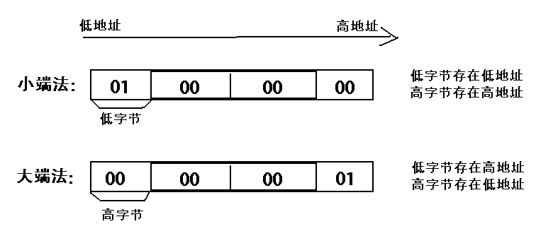

# NumPy 字节交换
在几乎所有的机器上，多字节对象都被存储为连续的字节序列。字节顺序，是跨越多字节的程序对象的存储规则。

大端模式：指数据的高字节保存在内存的低地址中，而数据的低字节保存在内存的高地址中，这样的存储模式有点儿类似于把数据当作字符串顺序处理：地址由小向大增加，而数据从高位往低位放；这和我们的阅读习惯一致。

小端模式：指数据的高字节保存在内存的高地址中，而数据的低字节保存在内存的低地址中，这种存储模式将地址的高低和数据位权有效地结合起来，高地址部分权值高，低地址部分权值低。

例如在 C 语言中，一个类型为 int 的变量 x 地址为 0x100，那么其对应地址表达式&x的值为 0x100。且x的四个字节将被存储在存储器的 0x100, 0x101, 0x102, 0x103位置。



## numpy.ndarray.byteswap()
numpy.ndarray.byteswap() 函数将 ndarray 中每个元素中的字节进行大小端转换。
```python
import numpy as np 
 
a = np.array([1,  256,  8755], dtype = np.int16)  
print ('我们的数组是：')
print (a)
print ('以十六进制表示内存中的数据：')
print (map(hex,a))
# byteswap() 函数通过传入 true 来原地交换 
print ('调用 byteswap() 函数：')
print (a.byteswap(True))
print ('十六进制形式：')
print (map(hex,a))
# 我们可以看到字节已经交换了
```

```python
import numpy as np

A = np.array([1, 256, 8755], dtype=np.int16)
print(A)
print(list(map(hex, A)))
print(A.byteswap(inplace=True))
print(list(map(hex, A)))
```