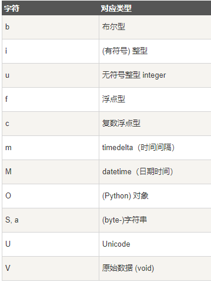

# NumPy 数据类型
numpy 支持的数据类型比 Python 内置的类型要多很多，基本上可以和 C 语言的数据类型对应上，其中部分类型对应为 Python 内置的类型。下表列举了常用 NumPy 基本类型。


numpy 的数值类型实际上是 dtype 对象的实例，并对应唯一的字符，包括 np.bool_，np.int32，np.float32，等等。

## 数据类型对象 (dtype)
数据类型对象（numpy.dtype 类的实例）用来描述与数组对应的内存区域是如何使用，它描述了数据的以下几个方面：
- 数据的类型（整数，浮点数或者 Python 对象）
- 数据的大小（例如， 整数使用多少个字节存储）
- 数据的字节顺序（小端法或大端法）
- 在结构化类型的情况下，字段的名称、每个字段的数据类型和每个字段所取的内存块的部分
- 如果数据类型是子数组，那么它的形状和数据类型是什么。
- 字节顺序是通过对数据类型预先设定 < 或 > 来决定的。 < 意味着小端法(最小值存储在最小的地址，即低位组放在最前面)。> 意味着大端法(最重要的字节存储在最小的地址，即高位组放在最前面)。

dtype 对象是使用以下语法构造的：
```
numpy.dtype(object, align, copy)
```
- object - 要转换为的数据类型对象
- align - 如果为 true，填充字段使其类似 C 的结构体。
- copy - 复制 dtype 对象 ，如果为 false，则是对内置数据类型对象的引用

```python
import numpy as np

# 使用标量类型
dt = np.dtype(np.int32)
print(dt)

# int8, int16, int32, int64 四种数据类型可以使用字符串 'i1', 'i2','i4','i8' 代替
dt = np.dtype('i4')
print(dt)

# 字节顺序标注
dt = np.dtype('<i4')
print(dt)

# 首先创建结构化数据类型
dt = np.dtype([('age',np.int8)]) 
print(dt)
# 将数据类型应用于 ndarray 对象
a = np.array([(10,),(20,),(30,)], dtype = dt) 
print(a)
# 类型字段名可以用于存取实际的 age 列
print(a['age'])

# 定义一个结构化数据类型 student，包含字符串字段 name，整数字段 age，及浮点字段 marks
student = np.dtype([('name','S20'), ('age', 'i1'), ('marks', 'f4')]) 
print(student)
# 定义一个结构化数据类型 student，包含字符串字段 name，整数字段 age，及浮点字段 marks
a = np.array([('abc', 21, 50),('xyz', 18, 75)], dtype = student) 
print(a)

```
每个内建类型都有一个唯一定义它的字符代码，如下：


