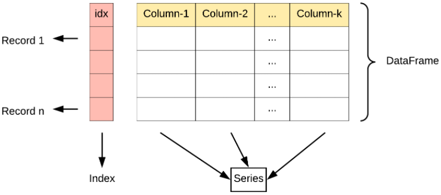

# Pandas 数据结构 - DataFrame

DataFrame 是一个表格型的数据结构，它含有一组有序的列，每列可以是不同的值类型（数值、字符串、布尔型值）。DataFrame 既有行索引也有列索引，它可以被看做由 Series 组成的字典（共同用一个索引）。




DataFrame 构造方法如下：
```
pandas.DataFrame( data, index, columns, dtype, copy)
```
参数说明：
+ data：一组数据(ndarray、series, map, lists, dict 等类型)。
+ index：索引值，或者可以称为行标签。
+ columns：列标签，默认为 RangeIndex (0, 1, 2, …, n) 。
+ dtype：数据类型。
+ copy：拷贝数据，默认为 False。

Pandas DataFrame 是一个二维的数组结构，类似二维数组。

```python
import pandas as pd

data = [['Google',10],['Runoob',12],['Wiki',13]]
df = pd.DataFrame(data,columns=['Site','Age'],dtype=float)
print(df)
```

以下实例使用 ndarrays 创建，ndarray 的长度必须相同， 如果传递了 index，则索引的长度应等于数组的长度。如果没有传递索引，则默认情况下，索引将是range(n)，其中n是数组长度。
```python
import pandas as pd

data = {'Site':['Google', 'Runoob', 'Wiki'], 'Age':[10, 12, 13]}
df = pd.DataFrame(data)
print (df)
```

还可以使用字典（key/value），其中字典的 key 为列名:
```python
import pandas as pd

data = [{'a': 1, 'b': 2},{'a': 5, 'b': 10, 'c': 20}]
df = pd.DataFrame(data)
print (df)
```
没有对应的部分数据为 NaN。

Pandas 可以使用 loc 属性返回指定行的数据，如果没有设置索引，第一行索引为 0，第二行索引为 1，以此类推：
```python
import pandas as pd

data = {
  "calories": [420, 380, 390],
  "duration": [50, 40, 45]
}

# 数据载入到 DataFrame 对象
df = pd.DataFrame(data)

# 返回第一行
print(df.loc[0])
# 返回第二行
print(df.loc[1])
```
注意：返回结果其实就是一个 Pandas Series 数据。

返回多行数据，使用 [[ ... ]] 格式，... 为各行的索引，以逗号隔开：
```python
import pandas as pd

data = {
  "calories": [420, 380, 390],
  "duration": [50, 40, 45]
}

# 数据载入到 DataFrame 对象
df = pd.DataFrame(data)

# 返回第一行和第二行
print(df.loc[[0, 1]])
```
注意：返回结果其实就是一个 Pandas DataFrame 数据。

我们可以指定索引值，如下实例：
```python
import pandas as pd

data = {
  "calories": [420, 380, 390],
  "duration": [50, 40, 45]
}

df = pd.DataFrame(data, index = ["day1", "day2", "day3"])
print(df)
```

Pandas 可以使用 loc 属性返回指定索引对应到某一行：
```python
import pandas as pd

data = {
  "calories": [420, 380, 390],
  "duration": [50, 40, 45]
}

df = pd.DataFrame(data, index = ["day1", "day2", "day3"])
# 指定索引
print(df.loc["day2"])
```

当处理数据时候 series 较多而我们其中只关注其中一些特定的列时候可以使用
```python
import pandas as pd

data = {
  "mango": [420, 380, 390],
  "apple": [50, 40, 45],
  "pear": [1, 2, 3],
  "banana": [23, 45,56]
}
df = pd.DataFrame(data)
# 假设我们只关注 apple 和 banana 的数据时，可以使用以下方法：
print(df[["apple","banana"]])
```

```python
import pandas as pd
# numpy
data1 = {'C': ['Google', 'Runoob'], 'A': [10, 12], 'B': [93.5, 89]}
df1 = pd.DataFrame(data1)
print(df1)

# dict
data2 = [{'C': 'Google', 'A': 10, 'B': 93.5}, {'C': 'Runoob', 'A': 12, 'B': 89}]
df2 = pd.DataFrame(data2)
print(df2)
```