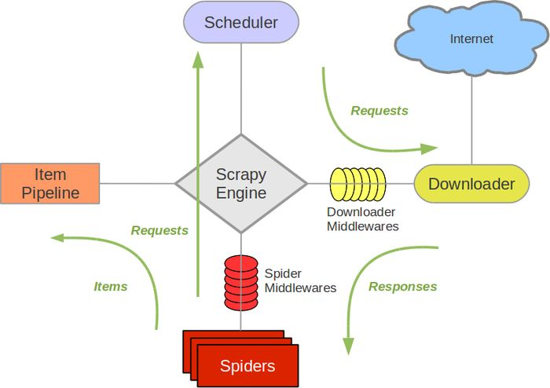

# Scrapy框架介绍
上一章介绍了pyspider框架的用法，缺点是可配置化程度不高，异常处理能力有限等，对于一些反爬程度高的网站的爬取显得力不从心。

Scrapy是一个基于Twisted的异步处理框架，纯python实现的，架构清晰，模块之间耦合度低，可扩展性强，可以完成各种需求。

## 1.架构介绍

+ Engine:引擎，处理整个系统的数据流处理，触发事务，是整个框架的核心
+ Item：项目，它定义了爬取结果的数据结构，爬取的数据会被赋值成该Item对象
+ Scheduler：调度器，接受引擎发过来的请求并将其加入队列中，在引擎再次请求的时候将请求提供给引擎
+ Downloader：下载器，下载网页内容，并将网页内容返回给蜘蛛
+ Spiders：蜘蛛，其内定义了爬取的逻辑和网页的解析规则，它主要负责解析响应并生成提取结果和新的请求
+ Item Pipeline：项目管道，负责处理由蜘蛛从网页中抽取的项目，它的主要任务是清洗，验证和存储数据
+ Download Middlewares：下载器中间件，位于引擎和下载器之间的钩子框架，主要处理引擎与下载器之间的请求及响应
+ Spider Middlewares：蜘蛛中间件，位于引擎和蜘蛛之间的钩子框架，主要处理向蜘蛛输入的响应和输出的结果及新的请求

## 2. 数据流
Scrapy中的**数据流**由引擎控制，数据流的过程如下：
1. Engine首先打开一个网站，找到该网站的Spider，并向该Spider请求第一个要爬取的URL
2. Engine从Spider中获取到第一个要爬取的URL，并通过Scheduler以及Request的形式调度
3. Engine向Schedule请求下一个要爬取的URL
4. Scheduler返回下一个要爬取的URL给Engine，Engine将URL通过Downloader Middlewares转发给Downloader下载
5. 一旦页面下载完毕，Downloader生成该页面的Response，并将其通过Downloader Middlewares发送个Engine
6. Engine从下载器中接受到Response，并将其通过Spider Middlewares发送给Spider处理
7. Spider处理Response，并返回提取的Item及新的Request给Engine
8. Engine将Spider返回的Item给Item Pipeline，将新的Request给Scheduler
9. 重复第2到8步，直到Scheduler中没有更多的Request，Engine关闭该网站，爬取结束

通过多个组件的相互协作，不同组件完成工作的不同、组件对异步处理的支持，Scrapy最大限度地利用了网络带宽，大大提高了数据爬取和处理的效率

## 3. 项目结构
```
scrapy.cfg
project/
    __init__.py
    items.py
    pipelines.py
    settings.py
    middlewares.py
    spiders/
        __init__.py
        spider1.py
        spider2.py
        ...
```
各个文件功能的描述如下：
+ scrapy.cfg：项目的配置文件，其内定义了项目的配置文件路径、部署相关信息等内容
+ items.py：定义了Item数据结构，所有的Item的定义都可以放到这里
+ pipelines.py：定义了Item Pipeline的实现，所有的Item Pipeline的实现都可以放在这里
+ settings.py：定义了项目的全局配置
+ middlewares.py：定义了Spider Middlewares和Downloader Middlewares的实现
+ spiders：其内包含一个个Spider的实现，每个Spider都有一个文件
