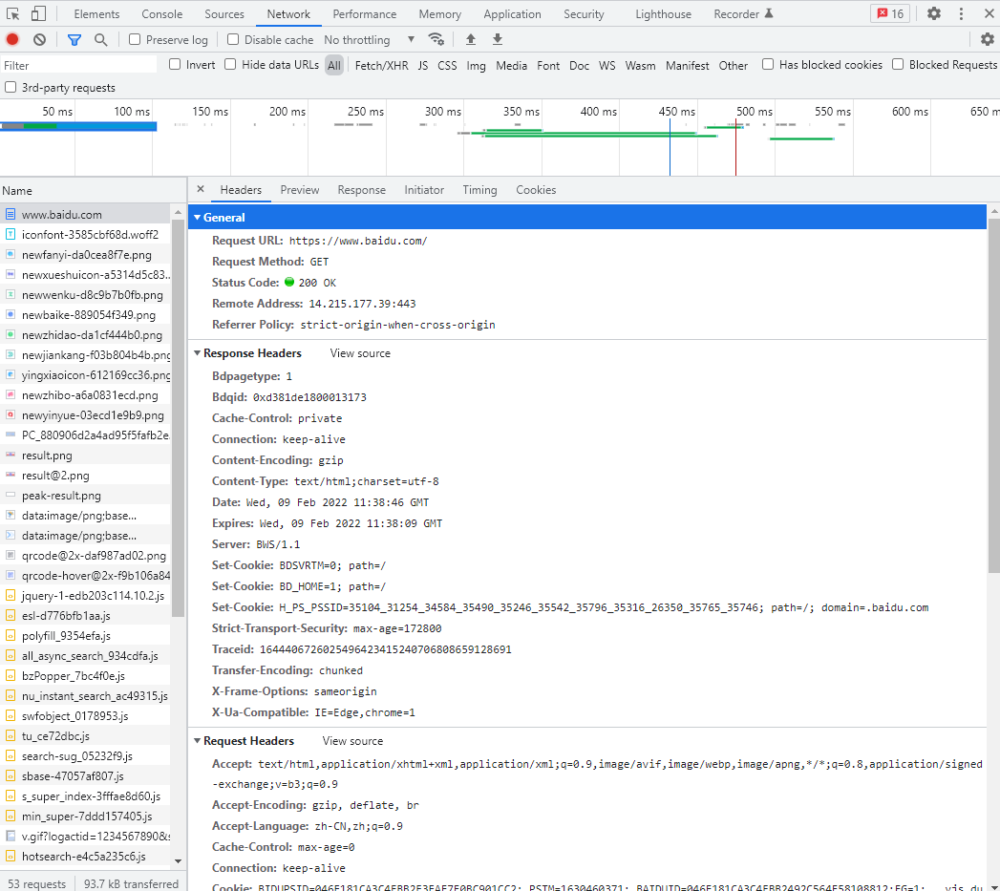

# 2.1 HTTP 基本原理

## 2.1.1 URI和URL
+ URI：统一资源标志符
+ URL：统一资源定位符
+ URN：统一资源名称

URL是URI的子集，也就是说每个URL都是URI，但不是每个URI都是URL。

在互联网中，URN用的非常少，几乎所有的URI都是URL，一般的网页链接，我们习惯上称为URL

## 2.1.2 超文本
hypertext 

超文本标记语言（HTML）

## 2.1.3 HTTP 和 HTTPS
HTTP：超文本传输协议。用于从网络传输超文本到本地浏览器的传送协议。
HTTPS：带加密的超文本传输协议。（SSL ? TLS）

## 2.1.4 HTTP请求过程
浏览器向网站所在的服务器发送了一个请求，网站服务器接收到这个请求后进行解析和处理，然后返回对应的响应，接着返回给浏览器。



General
```
Request URL: https://www.baidu.com/
Request Method: GET
Status Code: 200 OK
Remote Address: 14.215.177.39:443
Referrer Policy: strict-origin-when-cross-origin
```

Response Header  响应头

Request Header 请求头


## 2.1.5 请求
1. 请求方法
    + GET
    + POST
    + DELETE
    + HEAD
    + PUT
    + OPTIONS
    + CONNECT
    + TRACE

2. 请求url
    请求的网址，统一资源定位符URL。

3. 请求头
    用来说明服务器要使用的附加信息。
    + Accept
    + Accept-Language
    + Accept-Encoding
    + Cookie
    + Referer
    + User-Agent
    + Content-Type

4. 请求体
    一般承载的内容是POST请求中的表单数据，对于GET请求，请求体为空。
    
    设置合理的Content-Type与请求体间的关系：
    + application/x-www-form-urlencoded       表单数据
    + multipart/form-data                     表单文件上传
    + application/json                        json数据
    + text/xml                                XML数据

## 2.1.6 响应
1. 状态码
    响应状态码表示服务器的响应状态。
    + 100-199
    + 200-299 正常的响应
    + 300-399 
    + 400-499 客户端错误
    + 500-599 服务器错误

2. 响应头
    包含了服务器对响应的应答信息。
    + Date
    + Last-Modified
    + Content-Encoding
    + Server
    + Content-Type
    + Set-Cookie
    + Expires


3. 响应体
    服务器响应的数据，一般为HTML文档或者为Json数据。

