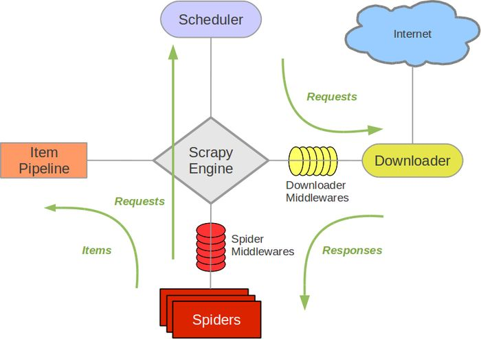

# Scrapy框架介绍

## 1.架构介绍

+ Engine:引擎
+ Item：项目
+ Scheduler：调度器
+ Downloader：下载器
+ Spiders：蜘蛛
+ Item Pipeline：项目管道
+ Download Middlewares：下载器中间件
+ Spider Middlewares：蜘蛛中间件

## 2. 数据流


## 3. 项目结构
```
scrapy.cfg
project/
    __init__.py
    items.py
    pipelines.py
    settings.py
    middlewares.py
    spiders/
        __init__.py
        spider1.py
        spider2.py
        ...
```
各个文件功能的描述如下：
scrapy.cfg
items.py
pipelines.py
settings.py
middlewares.py
spiders