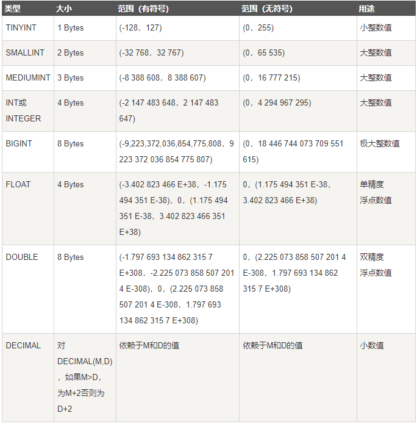
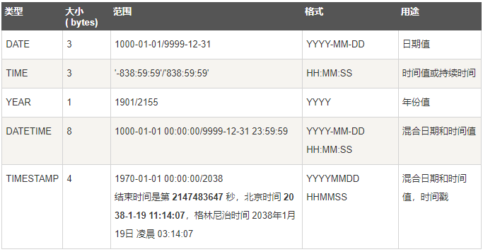
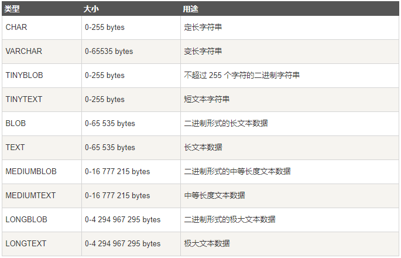

# mysql中的数据类型
mysql中定义字段的数据类型对优化数据库性能是非常重要的。大致分为三种：数值，日期/时间和字符串（字符）

## 数值类型

## 日期和时间

## 字符串

关于 char、varchar 与 text 平时没有太在意，一般来说，可能现在大家都是用 varchar。但是当要存储的内容比较大时，究竟是选择 varchar 还是 text 呢？

这三种类型比较：
1. char:  char 不用多说了，它是定长格式的，但是长度范围是 0~255. 当你想要储存一个长度不足 255 的字符时，Mysql 会用空格来填充剩下的字符。MySQL在存储char的时候，先去掉尾部的空格，若长度不足则用空格填充到相应长度。查询时，返回的数据尾部是没有空格的。
2. varchar:  关于 varchar，有的说最大长度是 255，也有的说是 65535，查阅很多资料后发现是这样的：varchar 类型在 5.0.3 以下的版本中的最大长度限制为 255，而在 5.0.3 及以上的版本中，varchar 数据类型的长度支持到了 65535，也就是说可以存放 65532 个字节（注意是字节而不是字符！！！）的数据（起始位和结束位占去了3个字节），也就是说，在 5.0.3 以下版本中需要使用固定的 TEXT 或 BLOB 格式存放的数据可以在高版本中使用可变长的 varchar 来存放，这样就能有效的减少数据库文件的大小。
3. text: 与 char 和 varchar 不同的是，text 不可以有默认值，其最大长度是 2 的 16 次方-1

总结起来，有几点：
+ 经常变化的字段用 varchar
+ 知道固定长度的用 char
+ 尽量用 varchar
+ 超过 255 字符的只能用 varchar 或者 text
+ 能用 varchar 的地方不用 text