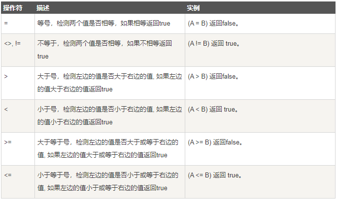

## WHERE 子句
WHERE子句起到筛选作用，通用语法如下：
```sql
SELECT field1, 
       field2, 
       ...
FROM 数据表名1, 
     数据表名2,
     ...
WHERE 筛选条件1 ADN | OR
      筛选条件2 ADN | OR
      ...
```
+ 查询语句中你可以使用一个或者多个表，表之间使用逗号, 分割，并使用WHERE语句来设定查询条件。
+ 你可以在 WHERE 子句中指定任何条件。
+ 你可以使用 AND 或者 OR 指定一个或多个条件。
+ WHERE 子句也可以运用于 SQL 的 DELETE 或者 UPDATE 命令。
+ WHERE 子句类似于程序语言中的 if 条件，根据 MySQL 表中的字段值来读取指定的数据。

## 操作符
以下为操作符列表，可用于 WHERE 子句中。下表中实例假定 A 为 10, B 为 20



如果我们想在 MySQL 数据表中读取指定的数据，WHERE 子句是非常有用的。

使用主键来作为 WHERE 子句的条件查询是非常快速的。

如果给定的条件在表中没有任何匹配的记录，那么查询不会返回任何数据。

MySQL 的 WHERE 子句的字符串比较是不区分大小写的。 你可以使用 BINARY 关键字来设定 WHERE 子句的字符串比较是区分大小写的。

示例如下：
```sql
mysql> SELECT * from runoob_tbl WHERE BINARY runoob_author='runoob.com';
Empty set (0.01 sec)
 
mysql> SELECT * from runoob_tbl WHERE BINARY runoob_author='RUNOOB.COM';
+-----------+---------------+---------------+-----------------+
| runoob_id | runoob_title  | runoob_author | submission_date |
+-----------+---------------+---------------+-----------------+
| 3         | JAVA 教程   | RUNOOB.COM    | 2016-05-06        |
| 4         | 学习 Python | RUNOOB.COM    | 2016-03-06        |
+-----------+---------------+---------------+-----------------+
2 rows in set (0.01 sec)
```

+ where：数据库中常用的是where关键字，用于在初始表中筛选查询。它是一个约束声明，用于约束数据，在返回结果集之前起作用。
+ group by:对select查询出来的结果集按照某个字段或者表达式进行分组，获得一组组的集合，然后从每组中取出一个指定字段或者表达式的值。
+ having：用于对where和group by查询出来的分组经行过滤，查出满足条件的分组结果。它是一个过滤声明，是在查询返回结果集以后对查询结果进行的过滤操作。

执行顺序:select –>where –> group by–> having–>order by

https://blog.csdn.net/alwayssmile21/article/details/52277854
```sql
(7)  SELECT 
(8)  DISTINCT <select_list>
(1)  FROM <left_table>
(3)  <join_type> JOIN <right_table>
(2)  ON <join_condition>
(4)  WHERE <where_condition>
(5)  GROUP BY <group_by_list>
(6)  HAVING <having_condition>
(9)  ORDER BY <order_by_condition>
(10) LIMIT <limit_number>

1. FROM  table1 left join table2 on 将table1和table2中的数据产生笛卡尔积，生成Temp1

2. JOIN table2  所以先是确定表，再确定关联条件

3. ON table1.column = table2.columu 确定表的绑定条件 由Temp1产生中间表Temp2

4. WHERE  对中间表Temp2产生的结果进行过滤  产生中间表Temp3

5. GROUP BY 对中间表Temp3进行分组，产生中间表Temp4

6. HAVING  对分组后的记录进行聚合 产生中间表Temp5

7. SELECT  对中间表Temp5进行列筛选，产生中间表 Temp6

8. DISTINCT 对中间表 Temp6进行去重，产生中间表 Temp7

9. ORDER BY 对Temp7中的数据进行排序，产生中间表Temp8

10. LIMIT 对中间表Temp8进行分页，产生中间表Temp9

```

## LIKE 子句
WHERE 子句中可以使用等号 = 来设定获取数据的条件，如 "runoob_author = 'RUNOOB.COM'"。

但是有时候我们需要获取 runoob_author 字段含有 "COM" 字符的所有记录，这时我们就需要在 WHERE 子句中使用 SQL LIKE 子句。

SQL LIKE 子句中使用百分号 %字符来表示任意字符，类似于UNIX或正则表达式中的星号 *。

如果没有使用百分号 %, LIKE 子句与等号 = 的效果是一样的。
```sql
SELECT field1, 
       field2,
       ...
FROM 数据表名
WHERE field1 LIKE condition1 [AND [OR]] filed2 = 'somevalue'
```
+ 你可以在 WHERE 子句中指定任何条件。
+ 你可以在 WHERE 子句中使用LIKE子句。
+ 你可以使用LIKE子句代替等号 =。
+ LIKE 通常与 % 一同使用，类似于一个元字符的搜索。
+ 你可以使用 AND 或者 OR 指定一个或多个条件。
+ 你可以在 DELETE 或 UPDATE 命令中使用 WHERE...LIKE 子句来指定条件。

示例如下：
```sql
mysql> use RUNOOB;
Database changed
mysql> SELECT * from runoob_tbl  WHERE runoob_author LIKE '%COM';
+-----------+---------------+---------------+-----------------+
| runoob_id | runoob_title  | runoob_author | submission_date |
+-----------+---------------+---------------+-----------------+
| 3         | 学习 Java     | RUNOOB.COM    | 2015-05-01      |
| 4         | 学习 Python   | RUNOOB.COM    | 2016-03-06      |
+-----------+---------------+---------------+-----------------+
2 rows in set (0.01 sec)
```

like 匹配/模糊匹配，会与 % 和 _ 结合使用。
```sql
'%a'     //以a结尾的数据
'a%'     //以a开头的数据
'%a%'    //含有a的数据
'_a_'    //三位且中间字母是a的
'_a'     //两位且结尾字母是a的
'a_'     //两位且开头字母是a的
```
查询以 java 字段开头的信息。
```sql
SELECT * FROM position WHERE name LIKE 'java%';
```
查询包含 java 字段的信息。
```sql
SELECT * FROM position WHERE name LIKE '%java%';
```
查询以 java 字段结尾的信息。
```sql
SELECT * FROM position WHERE name LIKE '%java';
```

在 where like 的条件查询中，SQL 提供了四种匹配方式:
+ %：表示任意 0 个或多个字符。可匹配任意类型和长度的字符，有些情况下若是中文，请使用两个百分号（%%）表示。
+ _：表示任意单个字符。匹配单个任意字符，它常用来限制表达式的字符长度语句。
+ []：表示括号内所列字符中的一个（类似正则表达式）。指定一个字符、字符串或范围，要求所匹配对象为它们中的任一个。
+ [^] ：表示不在括号所列之内的单个字符。其取值和 [] 相同，但它要求所匹配对象为指定字符以外的任一个字符。
+ 查询内容包含通配符时,由于通配符的缘故，导致我们查询特殊字符 “%”、“_”、“[” 的语句无法正常实现，而把特殊字符用 “[ ]” 括起便可正常查询。

## ORDER BY 子句
使用 ORDER BY 子句可以让我们按照哪个字段哪种方式来进行排序，再返回排序后的结果。通用语法如下：
```sql
SELECT field1, 
       field2, 
       ...
FROM table_name1, 
     table_name2,
     ...
ORDER BY field1 [ASC [DESC], 
         field2 [ASC [DESC],
         ...;
```
+ 你可以使用任何字段来作为排序的条件，从而返回排序后的查询结果。
+ 你可以设定多个字段来排序。
+ 你可以使用 ASC 或 DESC 关键字来设置查询结果是按升序或降序排列。 默认情况下，它是按升序排列(ASC)。
+ 你可以添加 WHERE...LIKE 子句来设置条件。

示例如下：
```sql
mysql> use RUNOOB;
Database changed
mysql> SELECT * from runoob_tbl ORDER BY submission_date ASC;
+-----------+---------------+---------------+-----------------+
| runoob_id | runoob_title  | runoob_author | submission_date |
+-----------+---------------+---------------+-----------------+
| 3         | 学习 Java     | RUNOOB.COM      | 2015-05-01    |
| 4         | 学习 Python   | RUNOOB.COM      | 2016-03-06    |
| 1         | 学习 PHP      | 菜鸟教程        | 2017-04-12    |
| 2         | 学习 MySQL    | 菜鸟教程        | 2017-04-12    |
+-----------+---------------+---------------+-----------------+
4 rows in set (0.01 sec)
 
mysql> SELECT * from runoob_tbl ORDER BY submission_date DESC;
+-----------+---------------+---------------+-----------------+
| runoob_id | runoob_title  | runoob_author | submission_date |
+-----------+---------------+---------------+-----------------+
| 1         | 学习 PHP      | 菜鸟教程      | 2017-04-12      |
| 2         | 学习 MySQL    | 菜鸟教程      | 2017-04-12      |
| 4         | 学习 Python   | RUNOOB.COM    | 2016-03-06      |
| 3         | 学习 Java     | RUNOOB.COM    | 2015-05-01      |
+-----------+---------------+---------------+-----------------+
4 rows in set (0.01 sec)
```

## GROUP BY 子句
GROUP BY 语句根据一个或多个列对结果集进行分组。在分组的列上我们可以使用 COUNT, SUM, AVG,等函数。通用语法如下：
```sql
SELECT column_name, function(column_name)
FROM table_name
WHERE column_name operator value
GROUP BY column_name;
```
示例如下：

先将以下数据导入数据库中:
```sql
SET NAMES utf8;
SET FOREIGN_KEY_CHECKS = 0;

-- ----------------------------
--  Table structure for `employee_tbl`
-- ----------------------------
DROP TABLE IF EXISTS `employee_tbl`;
CREATE TABLE `employee_tbl` (
  `id` int(11) NOT NULL,
  `name` char(10) NOT NULL DEFAULT '',
  `date` datetime NOT NULL,
  `signin` tinyint(4) NOT NULL DEFAULT '0' COMMENT '登录次数',
  PRIMARY KEY (`id`)
) ENGINE=InnoDB DEFAULT CHARSET=utf8;

-- ----------------------------
--  Records of `employee_tbl`
-- ----------------------------
BEGIN;
INSERT INTO `employee_tbl` VALUES ('1', '小明', '2016-04-22 15:25:33', '1'), 
                                  ('2', '小王', '2016-04-20 15:25:47', '3'), 
                                  ('3', '小丽', '2016-04-19 15:26:02', '2'), 
                                  ('4', '小王', '2016-04-07 15:26:14', '4'), 
                                  ('5', '小明', '2016-04-11 15:26:40', '4'), 
                                  ('6', '小明', '2016-04-04 15:26:54', '2');
COMMIT;

SET FOREIGN_KEY_CHECKS = 1;
```
导入成功后，执行以下 SQL 语句：
```sql
mysql> set names utf8;
mysql> SELECT * FROM employee_tbl;
+----+--------+---------------------+--------+
| id | name   | date                | signin |
+----+--------+---------------------+--------+
|  1 | 小明 | 2016-04-22 15:25:33   |      1 |
|  2 | 小王 | 2016-04-20 15:25:47   |      3 |
|  3 | 小丽 | 2016-04-19 15:26:02   |      2 |
|  4 | 小王 | 2016-04-07 15:26:14   |      4 |
|  5 | 小明 | 2016-04-11 15:26:40   |      4 |
|  6 | 小明 | 2016-04-04 15:26:54   |      2 |
+----+--------+---------------------+--------+
6 rows in set (0.00 sec)
```
接下来我们使用 GROUP BY 语句 将数据表按名字进行分组，并统计每个人有多少条记录：
```sql
mysql> SELECT name, COUNT(*) FROM employee_tbl GROUP BY name;
+--------+----------+
| name   | COUNT(*) |
+--------+----------+
| 小丽   |        1 |
| 小明   |        3 |
| 小王   |        2 |
+--------+----------+
3 rows in set (0.01 sec)
```

## UNION 操作符
UNION 操作符用于连接两个以上的 SELECT 语句的结果组合到一个结果集合中。多个 SELECT 语句会删除重复的数据。语法如下：
```sql
SELECT expression1, expression2, ... expression_n
FROM tables
[WHERE conditions]
UNION [ALL | DISTINCT]
SELECT expression1, expression2, ... expression_n
FROM tables
[WHERE conditions];
```
参数：
+ expression1, expression2, ... expression_n: 要检索的列。
+ tables: 要检索的数据表。
+ WHERE conditions: 可选， 检索条件。
+ DISTINCT: 可选，删除结果集中重复的数据。默认情况下 UNION 操作符已经删除了重复数据，所以 DISTINCT 修饰符对结果没啥影响。
+ ALL: 可选，返回所有结果集，包含重复数据。

示例：

下面是选自 "Websites" 表的数据：
```sql
mysql> SELECT * FROM Websites;
+----+--------------+---------------------------+-------+---------+
| id | name         | url                       | alexa | country |
+----+--------------+---------------------------+-------+---------+
| 1  | Google       | https://www.google.cm/    | 1     | USA     |
| 2  | 淘宝         | https://www.taobao.com/   | 13    | CN      |
| 3  | 菜鸟教程     | http://www.runoob.com/    | 4689  | CN      |
| 4  | 微博         | http://weibo.com/         | 20    | CN      |
| 5  | Facebook     | https://www.facebook.com/ | 3     | USA     |
| 7  | stackoverflow| http://stackoverflow.com/ |   0   | IND     |
+----+--------------+---------------------------+-------+---------+
```
下面是 "apps" APP 的数据：
```sql
mysql> SELECT * FROM apps;
+----+------------+-------------------------+---------+
| id | app_name   | url                     | country |
+----+------------+-------------------------+---------+
|  1 | QQ APP     | http://im.qq.com/       | CN      |
|  2 | 微博 APP   | http://weibo.com/       | CN      |
|  3 | 淘宝 APP   | https://www.taobao.com/ | CN      |
+----+------------+-------------------------+---------+
3 rows in set (0.00 sec)
```

UNION 实例
```sql
SELECT country FROM Websites
UNION
SELECT country FROM apps
ORDER BY country;
```
注释：UNION 不能用于列出两个表中所有的country。如果一些网站和APP来自同一个国家，每个国家只会列出一次。UNION 只会选取不同的值。请使用 UNION ALL 来选取重复的值！

UNION ALL 实例
```sql
SELECT country FROM Websites
UNION ALL
SELECT country FROM apps
ORDER BY country;
```

带有 WHERE 的 SQL UNION ALL
```sql
SELECT country, name FROM Websites
WHERE country='CN'
UNION ALL
SELECT country, app_name FROM apps
WHERE country='CN'
ORDER BY country;
```

+ UNION 语句：用于将不同表中相同列中查询的数据展示出来；（不包括重复数据）
+ UNION ALL 语句：用于将不同表中相同列中查询的数据展示出来；（包括重复数据）

使用形式如下：
+ SELECT 列名称 FROM 表名称 UNION SELECT 列名称 FROM 表名称 ORDER BY 列名称；
+ SELECT 列名称 FROM 表名称 UNION ALL SELECT 列名称 FROM 表名称 ORDER BY 列名称；

## JOIN连接子句
JOIN 按照功能大致分为如下三类：
+ INNER JOIN（内连接,或等值连接）：获取两个表中字段匹配关系的记录。
+ LEFT JOIN（左连接）：获取左表所有记录，即使右表没有对应匹配的记录。
+ RIGHT JOIN（右连接）： 与 LEFT JOIN 相反，用于获取右表所有记录，即使左表没有对应匹配的记录。

两张数据表数据如下：
```sql
mysql> use RUNOOB;
Database changed
mysql> SELECT * FROM tcount_tbl;
+---------------+--------------+
| runoob_author | runoob_count |
+---------------+--------------+
| 菜鸟教程      | 10           |
| RUNOOB.COM    | 20           |
| Google        | 22           |
+---------------+--------------+
3 rows in set (0.01 sec)
 
mysql> SELECT * from runoob_tbl;
+-----------+---------------+---------------+-----------------+
| runoob_id | runoob_title  | runoob_author | submission_date |
+-----------+---------------+---------------+-----------------+
| 1         | 学习 PHP      | 菜鸟教程      | 2017-04-12      |
| 2         | 学习 MySQL    | 菜鸟教程      | 2017-04-12      |
| 3         | 学习 Java     | RUNOOB.COM    | 2015-05-01      |
| 4         | 学习 Python   | RUNOOB.COM    | 2016-03-06      |
| 5         | 学习 C        | FK            | 2017-04-05      |
+-----------+---------------+---------------+-----------------+
5 rows in set (0.01 sec)
```
接下来我们就使用MySQL的INNER JOIN(也可以省略 INNER 使用 JOIN，效果一样)来连接以上两张表来读取runoob_tbl表中
所有runoob_author字段在tcount_tbl表对应的runoob_count字段值：
```sql
mysql> SELECT a.runoob_id, a.runoob_author, b.runoob_count FROM runoob_tbl a INNER JOIN tcount_tbl b ON a.runoob_author = b.runoob_author;
+-------------+-----------------+----------------+
| a.runoob_id | a.runoob_author | b.runoob_count |
+-------------+-----------------+----------------+
| 1           | 菜鸟教程        | 10             |
| 2           | 菜鸟教程        | 10             |
| 3           | RUNOOB.COM      | 20             |
| 4           | RUNOOB.COM      | 20             |
+-------------+-----------------+----------------+
4 rows in set (0.00 sec)
```
以上 SQL 语句等价于：
```sql
mysql> SELECT a.runoob_id, a.runoob_author, b.runoob_count FROM runoob_tbl a, tcount_tbl b WHERE a.runoob_author = b.runoob_author;
+-------------+-----------------+----------------+
| a.runoob_id | a.runoob_author | b.runoob_count |
+-------------+-----------------+----------------+
| 1           | 菜鸟教程        | 10             |
| 2           | 菜鸟教程        | 10             |
| 3           | RUNOOB.COM      | 20             |
| 4           | RUNOOB.COM      | 20             |
+-------------+-----------------+----------------+
4 rows in set (0.01 sec)
```


LEFT JOIN 与 JOIN 有所不同。 MySQL LEFT JOIN 会读取左边数据表的全部数据，即便右边表无对应数据。
```sql
mysql> SELECT a.runoob_id, a.runoob_author, b.runoob_count FROM runoob_tbl a LEFT JOIN tcount_tbl b ON a.runoob_author = b.runoob_author;
+-------------+-----------------+----------------+
| a.runoob_id | a.runoob_author | b.runoob_count |
+-------------+-----------------+----------------+
| 1           | 菜鸟教程        | 10             |
| 2           | 菜鸟教程        | 10             |
| 3           | RUNOOB.COM      | 20             |
| 4           | RUNOOB.COM      | 20             |
| 5           | FK              | NULL           |
+-------------+-----------------+----------------+
5 rows in set (0.01 sec)
```
以上实例中使用了 LEFT JOIN，该语句会读取左边的数据表 runoob_tbl 的所有选取的字段数据，即便在右侧表 tcount_tbl中 没有对应的 runoob_author 字段值。


RIGHT JOIN 会读取右边数据表的全部数据，即便左边边表无对应数据。
```sql
mysql> SELECT a.runoob_id, a.runoob_author, b.runoob_count FROM runoob_tbl a RIGHT JOIN tcount_tbl b ON a.runoob_author = b.runoob_author;
+-------------+-----------------+----------------+
| a.runoob_id | a.runoob_author | b.runoob_count |
+-------------+-----------------+----------------+
| 1           | 菜鸟教程        | 10             |
| 2           | 菜鸟教程        | 10             |
| 3           | RUNOOB.COM      | 20             |
| 4           | RUNOOB.COM      | 20             |
| NULL        | NULL            | 22             |
+-------------+-----------------+----------------+
5 rows in set (0.01 sec)
```
以上实例中使用了 RIGHT JOIN，该语句会读取右边的数据表 tcount_tbl 的所有选取的字段数据，即便在左侧表 runoob_tbl 中没有对应的runoob_author 字段值。
