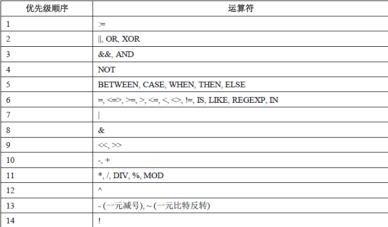

# MySQL 运算符


## 算术运算符
```
+	        加法
-	        减法
*	        乘法
/ 或 DIV	除法
% 或 MOD	取余
```
在除法运算和模运算中，如果除数为0，将是非法除数，返回结果为NULL。

## 比较运算符
```
=	                等于	
<>, !=	            不等于	
>	                大于	
<	                小于	
<=	                小于等于	
>=	                大于等于	
BETWEEN	            在两值之间	                >=min&&<=max
NOT BETWEEN	        不在两值之间	
IN	                在集合中	
NOT IN	            不在集合中	
<=>	                严格比较两个NULL值是否相等	两个操作码均为NULL时，其所得值为1；而当一个操作码为NULL时，其所得值为0
LIKE	            模糊匹配	
REGEXP 或 RLIKE	    正则式匹配	
IS NULL	            为空	
IS NOT NULL	        不为空	
```
通过这些比较运算符，可以判断表中的哪些记录是符合条件的。比较结果为真，则返回 1，为假则返回 0，比较结果不确定则返回 NULL。

## 逻辑运算符
逻辑运算符用来判断表达式的真假。如果表达式是真，结果返回 1。如果表达式是假，结果返回 0。
```
NOT 或 !	逻辑非
AND	        逻辑与
OR	        逻辑或
XOR	        逻辑异或
```

## 位运算符
位运算符是在二进制数上进行计算的运算符。位运算会先将操作数变成二进制数，进行位运算。然后再将计算结果从二进制数变回十进制数。
```
&	按位与
|	按位或
^	按位异或
!	取反
<<	左移
>>	右移
```

## 运算符优先级


最低优先级为： :=。最高优先级为： !、BINARY、 COLLATE。